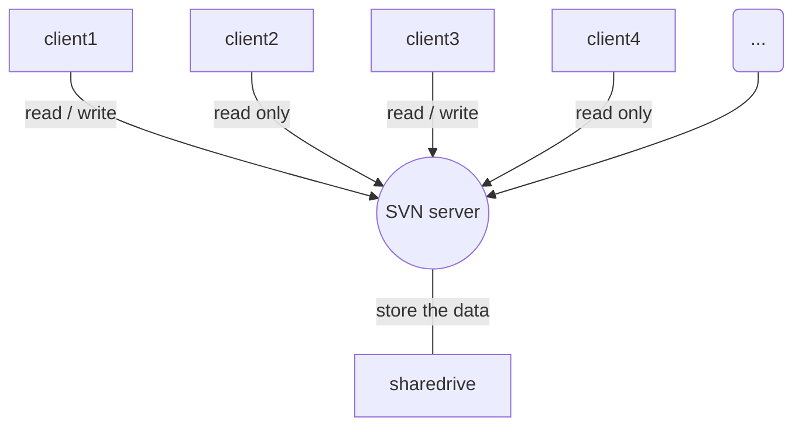

[TOC]
# 常见符号

趋近于 符号 \to(→) 
无穷大 符号 \infty(∞) 
求和公式( $\sum\limits_{i=1}^{n}f(i)$ )	\sum\limits_{i=1}^{n}f(i)
二元运算符：如\times(×), \div(÷), \pm(±), \circ(∘), \cdot(⋅)等; 
关系运算符：如\leq(≤), \geq(≥), \subset(⊂), \supset(⊃), \in(∈); 
否定关系运算符：如\not=(≠), \not<(≮), \not\supset (⊅); 
箭头, \leftarrow(←), \rightarrow(→), \longrightarrow(⟶), \uparrow(↑)等; 
其它符号, \nabla(∇), \angle(∠), \forall(∀), \exists(∃), \prime($\prime$ ，即导数的撇′′). 
而对于专有名词,如一些函数名, 如sin x中的sin, 就要用罗马体, 而不是一般的数学斜体排印,我们可以用sinx, 也可以用TeX提供的直接在函数名前加”\”的方法: sinx \sin⁡x,一般的 函数均有定义, 如\sin, \cos, \lim, \log等.

## 希腊字母

| 字母名称 | 大写 | markdown原文 | 小写 | markdown原文 |
| -------- | ---- | ------------ | ---- | ------------ |
| alpha    | A    | A            | α    | \alpha       |
| beta     | B    | B            | β    | \beta        |
| gamma    | Γ    | \Gamma       | γ    | \gamma       |
| delta    | Δ    | \Delta       | δ    | \delta       |
| epsilon  | E    | E            | ϵ    | \epsilon     |
|          |      |              | ε    | \varepsilon  |
| zeta     | Z    | Z            | ζ    | \zeta        |
| eta      | E    | E            | η    | \eta         |
| theta    | Θ    | \Theta       | θ    | \theta       |
| iota     | I    | I            | ι    | \iota        |
| kappa    | K    | K            | κ    | \kappa       |
| lambda   | Λ    | \Lambda      | λ    | \lambda      |
| Mu       | M    | M            | μ    | \mu          |
| nu       | N    | N            | ν    | \nu          |
| xi       | Ξ    | \Xi          | ξ    | \xi          |
| omicron  | O    | O            | ο    | \omicron     |
| pi       | Π    | \Pi          | π    | \omicron     |
| rho      | P    | P            | ρ    | \rho         |
| sigma    | Σ    | \Sigma       | σ    | \sigma       |
| tau      | T    | T            | τ    | \tau         |
| upsilon  | Υ    | \Upsilon     | υ    | \upsilon     |
| phi      | Φ    | \Phi         | ϕ    | \phi         |
|          |      |              | φ    | \varphi      |
| chi      | X    | X            | χ    | \chi         |
| psi      | Ψ    | \Psi         | ψ    | \psi         |

# 常见表达式

## 分段函数

需要效果为 

$$
P_{r-j}=
 \begin{cases}
   0 &\mbox{if $r-j$ is odd}\\
   r!\,(-1)^{(r-j)/2} &\mbox{if $r-j$ is even}
   \end{cases}
$$

源码为：

```Tex
$$
P_{r-j}=
 \begin{cases}
   0 &\mbox{if $r-j$ is odd}\\
   r!\,(-1)^{(r-j)/2} &\mbox{if $r-j$ is even}
   \end{cases}
$$
```

## 公式推导过程

有时一行放不下所有的推导过程，放到多行并使得每行的等号对齐可以大大增加可读性。下面这个例子原始形式是A，然后经过三步推导最终得到了D。以符号 & 的下一个字符进行对齐，末尾的三个反斜杠 \ 用来分割行。这里是由于markdown与mathjax的渲染有冲突才需要用三个反斜杠。 
需要效果为 

​			$$ \begin {aligned} A&=B \\\ &=C \\\ &=D \end {aligned} $$

源码为

```Tex
$
\begin {aligned}
A&=B \\\
&=C \\\
&=D
\end {aligned}
$
```


# 流程图

## UML流程图

语法参考：[https://github.com/adrai/flowchart.js](https://link.jianshu.com/?t=https://github.com/adrai/flowchart.js)

范例1

```flow
st=>start: Start|past:>http://www.google.com[blank]
e=>end: End:>http://www.google.com
op1=>operation: My Operation|past
op2=>operation: Stuff|current
sub1=>subroutine: My Subroutine|invalid
cond=>condition: Yes 
or No?|approved:>http://www.baidu.com
c2=>condition: Good idea|rejected
io=>inputoutput: catch something...|request

st->op1(right)->cond
cond(yes, right)->c2
cond(no)->sub1(left)->op1
c2(yes)->io->e
c2(no)->op2->e
```

范例2
```flow
st=>start: Start|past:>http://www.google.com[blank]
e=>end: End:>http://www.google.com
op1=>operation: get_hotel_ids|past
op2=>operation: get_proxy|current
sub1=>subroutine: get_proxy|current
op3=>operation: save_comment|current
op4=>operation: set_sentiment|current
op5=>operation: set_record|current

cond1=>condition: ids_remain空?
cond2=>condition: proxy_list空?
cond3=>condition: ids_got空?
cond4=>condition: 爬取成功??
cond5=>condition: ids_remain空?

io1=>inputoutput: ids-remain
io2=>inputoutput: proxy_list
io3=>inputoutput: ids-got

st->op1(right)->io1->cond1
cond1(yes)->sub1->io2->cond2
cond2(no)->op3
cond2(yes)->sub1
cond1(no)->op3->cond4
cond4(yes)->io3->cond3
cond4(no)->io1
cond3(no)->op4
cond3(yes, right)->cond5
cond5(yes)->op5
cond5(no)->cond3
op5->e
```


## UML序列图

语法参考：[https://bramp.github.io/js-sequence-diagrams/](https://link.jianshu.com/?t=https://bramp.github.io/js-sequence-diagrams/)

```sequence
Title:连接建立的过程
客户主机->服务器主机: 连接请求（SYN=1,seq=client_isn） 
服务器主机->客户主机: 授予连接（SYN=1,seq=client_isn）\n ack=client_isn+1
客户主机->服务器主机: 确认（SYN=0,seq=client_isn+1）\nack=server_isn+1
```
## mermaid

语法参考：[http://knsv.github.io/mermaid](https://link.jianshu.com?t=http://knsv.github.io/mermaid)



## CmdMarkdown语法
[『Cmd 技术渲染的沙箱页面，点击此处编写自己的文档』](https://www.zybuluo.com/mdeditor "作业部落旗下 Cmd 在线 Markdown 编辑阅读器")

# Cmd Markdown 简明语法手册

标签： Cmd-Markdown

---

### 1. 斜体和粗体

使用 * 和 ** 表示斜体和粗体。

示例：

这是 *斜体*，这是 **粗体**。

### 2. 分级标题

使用 === 表示一级标题，使用 --- 表示二级标题。

示例：

```
这是一个一级标题
============================

这是一个二级标题
--------------------------------------------------

### 这是一个三级标题
```

你也可以选择在行首加井号表示不同级别的标题 (H1-H6)，例如：# H1, ## H2, ### H3，#### H4。

### 3. 外链接

使用 \[描述](链接地址) 为文字增加外链接。

示例：

这是去往 [本人博客](http://ghosertblog.github.com) 的链接。

### 4. 无序列表

使用 *，+，- 表示无序列表。

示例：

- 无序列表项 一
- 无序列表项 二
- 无序列表项 三

### 5. 有序列表

使用数字和点表示有序列表。

示例：

1. 有序列表项 一
2. 有序列表项 二
3. 有序列表项 三

### 6. 文字引用

使用 > 表示文字引用。

示例：

> 野火烧不尽，春风吹又生。

### 7. 行内代码块

使用 \`代码` 表示行内代码块。

示例：

让我们聊聊 `html`。

### 8.  代码块

使用 四个缩进空格 表示代码块。

示例：

    这是一个代码块，此行左侧有四个不可见的空格。

### 9.  插入图像

使用 \!\[描述](图片链接地址) 插入图像。

示例：


# Cmd Markdown 高阶语法手册

### 1. 内容目录

在段落中填写 `[TOC]` 以显示全文内容的目录结构。

[TOC]

### 2. 标签分类

在编辑区任意行的列首位置输入以下代码给文稿标签：

标签： 数学 英语 Markdown

或者

Tags： 数学 英语 Markdown

### 3. 删除线

使用 ~~ 表示删除线。

~~这是一段错误的文本。~~

### 4. 注脚

使用 [^keyword] 表示注脚。

这是一个注脚[^footnote]的样例。

这是第二个注脚[^footnote2]的样例。

### 5. LaTeX 公式

$ 表示行内公式： 

质能守恒方程可以用一个很简洁的方程式 $E=mc^2$ 来表达。

$$ 表示整行公式：

$$\sum_{i=1}^n a_i=0$$

$$f(x_1,x_x,\ldots,x_n) = x_1^2 + x_2^2 + \cdots + x_n^2 $$

$$\sum^{j-1}_{k=0}{\widehat{\gamma}_{kj} z_k}$$

访问 [MathJax](http://meta.math.stackexchange.com/questions/5020/mathjax-basic-tutorial-and-quick-reference) 参考更多使用方法。

### 6. 加强的代码块

支持四十一种编程语言的语法高亮的显示，行号显示。

非代码示例：

```
$ sudo apt-get install vim-gnome
```

Python 示例：

```python
@requires_authorization
def somefunc(param1='', param2=0):
    '''A docstring'''
    if param1 > param2: # interesting
        print 'Greater'
    return (param2 - param1 + 1) or None

class SomeClass:
    pass

>>> message = '''interpreter
... prompt'''
```

JavaScript 示例：

``` javascript
/**
* nth element in the fibonacci series.
* @param n >= 0
* @return the nth element, >= 0.
*/
function fib(n) {
  var a = 1, b = 1;
  var tmp;
  while (--n >= 0) {
    tmp = a;
    a += b;
    b = tmp;
  }
  return a;
}

document.write(fib(10));
```

### 7. 流程图

#### 示例

```flow
st=>start: Start:>https://www.zybuluo.com
io=>inputoutput: verification
op=>operation: Your Operation
cond=>condition: Yes or No?
sub=>subroutine: Your Subroutine
e=>end

st->io->op->cond
cond(yes)->e
cond(no)->sub->io
```

#### 更多语法参考：[流程图语法参考](http://adrai.github.io/flowchart.js/)

### 8. 序列图

#### 示例 1

```seq
Alice->Bob: Hello Bob, how are you?
Note right of Bob: Bob thinks
Bob-->Alice: I am good thanks!
```

#### 示例 2

```seq
Title: Here is a title
A->B: Normal line
B-->C: Dashed line
C->>D: Open arrow
D-->>A: Dashed open arrow
```

#### 更多语法参考：[序列图语法参考](http://bramp.github.io/js-sequence-diagrams/)

### 9. 甘特图

甘特图内在思想简单。基本是一条线条图，横轴表示时间，纵轴表示活动（项目），线条表示在整个期间上计划和实际的活动完成情况。它直观地表明任务计划在什么时候进行，及实际进展与计划要求的对比。

```gantt
    title 项目开发流程
    section 项目确定
        需求分析       :a1, 2016-06-22, 3d
        可行性报告     :after a1, 5d
        概念验证       : 5d
    section 项目实施
        概要设计      :2016-07-05  , 5d
        详细设计      :2016-07-08, 10d
        编码          :2016-07-15, 10d
        测试          :2016-07-22, 5d
    section 发布验收
        发布: 2d
        验收: 3d
```

#### 更多语法参考：[甘特图语法参考](https://knsv.github.io/mermaid/#gant-diagrams)

### 10. Mermaid 流程图

```graphLR
    A[Hard edge] -->|Link text| B(Round edge)
    B --> C{Decision}
    C -->|One| D[Result one]
    C -->|Two| E[Result two]
```

#### 更多语法参考：[Mermaid 流程图语法参考](https://knsv.github.io/mermaid/#flowcharts-basic-syntax)

### 11. Mermaid 序列图

```sequence
    Alice->John: Hello John, how are you?
    loop every minute
        John-->Alice: Great!
    end
```

#### 更多语法参考：[Mermaid 序列图语法参考](https://knsv.github.io/mermaid/#sequence-diagrams)

### 12. 表格支持

| 项目        | 价格   |  数量  |
| --------   | -----:  | :----:  |
| 计算机     | \$1600 |   5     |
| 手机        |   \$12   |   12   |
| 管线        |    \$1    |  234  |


### 13. 定义型列表

名词 1
:   定义 1（左侧有一个可见的冒号和四个不可见的空格）

代码块 2
:   这是代码块的定义（左侧有一个可见的冒号和四个不可见的空格）

        代码块（左侧有八个不可见的空格）

### 14. Html 标签

本站支持在 Markdown 语法中嵌套 Html 标签，譬如，你可以用 Html 写一个纵跨两行的表格：

    <table>
        <tr>
            <th rowspan="2">值班人员</th>
            <th>星期一</th>
            <th>星期二</th>
            <th>星期三</th>
        </tr>
        <tr>
            <td>李强</td>
            <td>张明</td>
            <td>王平</td>
        </tr>
    </table>


<table>
    <tr>
        <th rowspan="2">值班人员</th>
        <th>星期一</th>
        <th>星期二</th>
        <th>星期三</th>
    </tr>
    <tr>
        <td>李强</td>
        <td>张明</td>
        <td>王平</td>
    </tr>
</table>

### 15. 内嵌图标

本站的图标系统对外开放，在文档中输入

    <i class="icon-weibo"></i>

即显示微博的图标： <i class="icon-weibo icon-2x"></i>

替换 上述 `i 标签` 内的 `icon-weibo` 以显示不同的图标，例如：

    <i class="icon-renren"></i>

即显示人人的图标： <i class="icon-renren icon-2x"></i>

更多的图标和玩法可以参看 [font-awesome](http://fortawesome.github.io/Font-Awesome/3.2.1/icons/) 官方网站。

### 16. 待办事宜 Todo 列表

使用带有 [ ] 或 [x] （未完成或已完成）项的列表语法撰写一个待办事宜列表，并且支持子列表嵌套以及混用Markdown语法，例如：

    - [ ] **Cmd Markdown 开发**
        - [ ] 改进 Cmd 渲染算法，使用局部渲染技术提高渲染效率
        - [ ] 支持以 PDF 格式导出文稿
        - [x] 新增Todo列表功能 [语法参考](https://github.com/blog/1375-task-lists-in-gfm-issues-pulls-comments)
        - [x] 改进 LaTex 功能
            - [x] 修复 LaTex 公式渲染问题
            - [x] 新增 LaTex 公式编号功能 [语法参考](http://docs.mathjax.org/en/latest/tex.html#tex-eq-numbers)
    - [ ] **七月旅行准备**
        - [ ] 准备邮轮上需要携带的物品
        - [ ] 浏览日本免税店的物品
        - [x] 购买蓝宝石公主号七月一日的船票
        
对应显示如下待办事宜 Todo 列表：
        
- [ ] **Cmd Markdown 开发**
    - [ ] 改进 Cmd 渲染算法，使用局部渲染技术提高渲染效率
    - [ ] 支持以 PDF 格式导出文稿
    - [x] 新增Todo列表功能 [语法参考](https://github.com/blog/1375-task-lists-in-gfm-issues-pulls-comments)
    - [x] 改进 LaTex 功能
        - [x] 修复 LaTex 公式渲染问题
        - [x] 新增 LaTex 公式编号功能 [语法参考](http://docs.mathjax.org/en/latest/tex.html#tex-eq-numbers)
- [ ] **七月旅行准备**
    - [ ] 准备邮轮上需要携带的物品
    - [ ] 浏览日本免税店的物品
    - [x] 购买蓝宝石公主号七月一日的船票
        
        
[^footnote]: 这是一个 *注脚* 的 **文本**。

[^footnote2]: 这是另一个 *注脚* 的 **文本**。


 

 

 

 

 