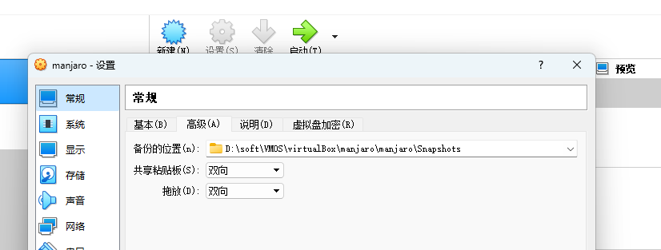
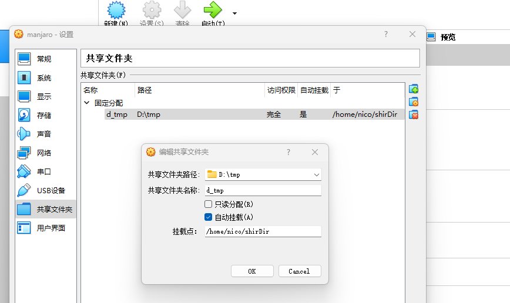
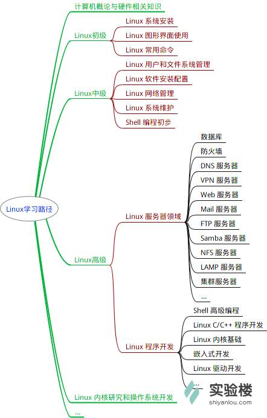

[TOC]

zsh:1: 没有那个文件或目录: 01Linux/


## 一 Ubuntu 22.04 Linux更换源教程

> 为了更快的下载速度，我们常常需要把Ubuntu自带的国外源换成国内源

更换源步骤如下：

 1、备份源列表

```bash
sudo cp /etc/apt/sources.list /etc/apt/sources.list.bak
```

2、命令行打开`sources.list`文件

```bash
sudo gedit /etc/apt/sources.list
# 或者
sudo vi /etc/apt/sources.list
```

 将源文件内容全部注释，并添加以下内容任意源

> 阿里云源

```cpp
deb http://mirrors.aliyun.com/ubuntu/ focal main restricted universe multiverse
deb-src http://mirrors.aliyun.com/ubuntu/ focal main restricted universe multiverse

deb http://mirrors.aliyun.com/ubuntu/ focal-security main restricted universe multiverse
deb-src http://mirrors.aliyun.com/ubuntu/ focal-security main restricted universe multiverse

deb http://mirrors.aliyun.com/ubuntu/ focal-updates main restricted universe multiverse
deb-src http://mirrors.aliyun.com/ubuntu/ focal-updates main restricted universe multiverse

deb http://mirrors.aliyun.com/ubuntu/ focal-proposed main restricted universe multiverse
deb-src http://mirrors.aliyun.com/ubuntu/ focal-proposed main restricted universe multiverse

deb http://mirrors.aliyun.com/ubuntu/ focal-backports main restricted universe multiverse
deb-src http://mirrors.aliyun.com/ubuntu/ focal-backports main restricted universe multiverse
```

> 清华源

```cpp
deb http://mirrors.tuna.tsinghua.edu.cn/ubuntu/ focal main restricted
deb http://mirrors.tuna.tsinghua.edu.cn/ubuntu/ focal-updates main restricted
deb http://mirrors.tuna.tsinghua.edu.cn/ubuntu/ focal universe
deb http://mirrors.tuna.tsinghua.edu.cn/ubuntu/ focal-updates universe
deb http://mirrors.tuna.tsinghua.edu.cn/ubuntu/ focal multiverse
deb http://mirrors.tuna.tsinghua.edu.cn/ubuntu/ focal-updates multiverse
deb http://mirrors.tuna.tsinghua.edu.cn/ubuntu/ focal-backports main restricted universe multiverse
deb http://mirrors.tuna.tsinghua.edu.cn/ubuntu/ focal-security main restricted
deb http://mirrors.tuna.tsinghua.edu.cn/ubuntu/ focal-security universe
deb http://mirrors.tuna.tsinghua.edu.cn/ubuntu/ focal-security multiverse
```

 3、保存：`ESC+：wq！`

##  二 更新与apt

+ 更新之前可以安装nala包管理工具
```shell
sudo apt install nala
# 后续所有apt命令可改为nala了
# 如sudo nala update
# 不好用！！！
```

> 换源之后就可以快速的更新了

```shell
sudo apt-get update: 升级安装包相关的命令,刷新可安装的软件列表(但是不做任何实际的安装动作)

sudo apt-get upgrade: 进行安装包的更新(软件版本的升级)

sudo apt-get dist-upgrade: 进行系统版本的升级(Ubuntu版本的升级)

sudo do-release-upgrade: Ubuntu官方推荐的系统升级方式,若加参数-d还可以升级到开发版本,但会不稳定

sudo apt-get autoclean: 清理旧版本的软件缓存

sudo apt-get clean: 清理所有软件缓存

sudo apt-get autoremove: 删除系统不再使用的孤立软件
```


 4、更新源

```sql
sudo apt-get update
```

 5、更新软件，然后你就可以感受到更换国内源之后的飞速提升了

```csharp
sudo apt-get dist-upgrade
sudo apt-get upgrade
```

(6、或者如下操作)

```
sudo apt update && sudo apt-get dist-upgrade -y && sudo apt-get upgrade -y
```


## 三 Ubuntu环境构建

+ 设置Ubuntu的Root密码（如果没有）

```shell
sudo passwd root
-- 输入三次密码即可
```

### Gnome基本环境工具

+ 安装基本工具

```shell
# 使用gnome-teaks设置进行优化
sudo apt install gnome-tweaks
# 安装插件管理工具
sudo apt install 
```

+ ubuntu22 Dock栏最小化最大化切换

```shell
gsettings set org.gnome.shell.extensions.dash-to-dock click-action 'minimize'
```

+ 安装编解码器，和微软字体（播放流媒体需要）

```shell
 sudo apt install ubuntu-restricted-extras
```

+ 设置gnome-terminal的默认开启位置
> 先安装gconf-editor , 安装完成后打开gconf-editor
> 找到`/desktop/gnome/applications/terminal/exec`
> 并修改该项的值为： gnome-terminal  --geometry 120x30+154+70
> 说明：90：宽度 46：高度 154：横坐标 70：纵坐标


+ terminator安装

> 默认情况下安装完terminator后会替换默认终端，使用如下方式切会自带终端：
> `sudo update-alternatives --config x-terminal-emulator`
> 选择/usr/bin/gnome-terminal.wrapper；
> 

### Github与Git

+ Ubuntu可以使用gh官方token管理工具进行处理

```shell
# 安装git
sudo apt-get install git

# 管理账户
sudo apt install gh
gh auth login    
```

### 按键映射


```bash
sudo apt install dconf-editor
dconf-editor
# 使用dconf-editor切换

# 使用gnome-teaks设置
sudo apt install gnome-tweaks
# 打开优化设置后->找到键盘设置->选择其他布局选项
```

### 基础

 + `flameshot`：截图工具1

```bash
# 安装
sudo apt install flameshot
```

+ `scrot`：截图工具2

```bash
sudo apt-get install scrot
# 截图
scrot -s temp.png
```


+ ranger：终端下目录管理

```bash
sudo apt-get install ranger
```

+ neofetch ：查看系统配置信息

```bash
sudo apt-get install neofetch
```

+ tree：查看目录树

```bash
sudo apt-get install tree
```

+ htop：系统资源使用实时监控

```bash
sudo apt-get install htop
```

+ `indicator-sysmonitor` 顶部显示系统利用率

```bash
 sudo add-apt-repository --remove ppa:fossfreedom/indicator-sysmonitor
 sudo apt-get update
 sudo apt-get install indicator-sysmonitor
 indicator-sysmonitor &
```

+ vim

```bash
sudo apt-get install vim
```

+ nvim1：deb方式安装指定版本nvim

```bash
sudo apt remove neovim
sudo dpkg -i nvim-linux.deb
sudo apt install ./nvim-linux.deb
sudo apt autoremove
sudo apt install ./nvim-linux.deb
sudo chmod  nvim-linux.deb
sudo apt install ./nvim-linux.deb
nvim --version
```

+ nvim2: appimg格式
    + 下载appimg格式，放入特定文件夹
    + 给appimg文件添加执行权限
    + 最后配置环境变量即可

### 星火商店

1、下载deb包

2、安装（apt，而不是apt-get）

```bash
sudo apt install ./spark-store_xxx.deb
```

### 防火墙ufw

1、安装

```bash
sudo apt-get install ufw
```

2、规则添加

```bash
sudo ufw allow 8080
sudo ufw allow 8090
sudo ufw allow 8091
sudo ufw allow 587
sudo ufw allow 6379
sudo ufw allow 8081
sudo ufw allow 8082
sudo ufw allow 9876
sudo ufw allow 2181
sudo ufw allow 22
sudo ufw allow 7890
sudo ufw allow 31181
sudo ufw allow 8887
sudo ufw allow 10911
sudo ufw allow 55602
sudo ufw allow 10909
sudo ufw allow 15555
sudo ufw allow 9876
sudo ufw allow 10912
sudo ufw allow 10909
sudo ufw allow 7890
# sudo ufw allow from 192.168.1.1
```

3、查看规则

```bash
sudo ufw status verbose
```

### tabby 终端连接工具

```bash
sudo dpkg -i tabby-1.0.181-linux-x64.deb
sudo apt-get install ./tabby-1.0.181-linux-x64.deb
sudo apt-get --fix-broken install ./tabby-1.0.181-linux-x64.deb
rm tabby-1.0.181-linux-x64.deb
```

### 查找文件

+ fd

```bash
sudo apt-get install fd
```

+ fzf：终端下模糊搜索

```bash
sudo apt-get install fzf
```

### 文件管理器

+ sigma file manager

1、下载软件后，设置执行权限

2、安装依赖

```shell
-- ubuntu22.04
sudo apt install libfuse2
```

3、双击AppImage即可运行

+ lf

```bash
sudo apt-get install if
```

+ fd

### 窗口管理器

+ i3

### 终端多任务

+ tmux

+ zellij

```bash
sudo apt-get install zellij
```
### Redis安装

+ 直接安装

```shell
sudo apt install redis-server
-- 安装完成后，测试Redis是否正常工作
redis-cli --version
```

+ 客户端1: `Tiny RDM`
+ 客户端2：`Another Redis`

### Zookper安装

+ 下载二进制文件压缩包后解压，执行时要进入到bin目录下用bash shell执行

+ [可能配置文件未创建成功](https://blog.csdn.net/han_xuefeng/article/details/119885832)

### RocketMQ安装

+ [注意配置](https://blog.csdn.net/mario08/article/details/107243730)


### PostgreSQL

+ 安装：
+ 初始密码

```shell
# 登录之后给默认用户“postgres”设置密码
sudo -u postgres psql postgres
# 给postgres用户设置密码
postgres= # \password postgres          
# 输入两次密码
Enter new password:
Enter it again:
```

### Mysql8+
```shell
# 安装
```

### zsh

+ oh-my-zsh

  + zsh-autosuggestions
  + zsh-syntax-highlighting
  + incr

```shell
mkdir ~/.oh-my-zsh/plugins/incr 
# 官网下载文件放置incr目录下
cd ~/.oh-my-zsh/plugins/incr
wget https://mimosa-pudica.net/src/incr-0.2.zsh  
source incr*.zsh
# 编辑.zshrc文件中的插件配置后重载配置文件即可
# !!!
# 如提示incr不存在可将incr-0.2.zsh 改为incr.plugin.zsh  或incr.zsh重试  
```

### fish-配置麻烦不好用

```shell
# 安装
sudo apt install fish
# 关闭问候语
# 配置文件中 .config/fish/config.fish 中添加如下配置
set fish_greeting
```

+ fish配置环境变量

> 在/etc/fish/conf.d目录下的一个fish文件对应一个环境变量，如PATH.fish内容如下：
>
> `set -gx PATH $PATH $JAVA_HOME/bin $JRE_HOME/bin $ROCKETMQ_HOME/bin $ZOOKEEPER_HOME/bin`
> 
> 对应profie如下：
>
> `export PATH=$PATH:$JAVA_HOME/bin:$JRE_HOME/bin:$ROCKETMQ_HOME/bin:$ZOOKEEPER_HOME/bin`

### OpenVPN
```shell
# 安装客户端
sudo apt install openvpn
# 启用客户端
openvpn /etc/openvpn/client.ovpn
# 可以用如下方式隐藏vpn启动的连接终端
openvpn /etc/openvpn/client.ovpn > /dev/null &
```
+ 配置：将配置文件移动到`/etc/openvpn`目录下

[配置详解](https://o-u-u.com/?p=2390)

### Clash


+ [参考1](https://www.alvinkwok.cn/2022/01/29/2022/01/Clash%20For%20Linux%20Install%20Guide/)

+ [参考2](https://juejin.cn/post/7127911250654134302)

> Ubuntu配置多个代理端口（如31181，7890）
> 新建`/etc/profile.d/proxy.sh`填写配置信息
> 
+ [参考链接](https://blog.csdn.net/u011119817/article/details/110856212)
+ 推荐：`Clash Verge`

### wine8+

+ 下载`configFile`中的key文件
+ [wine-builds 清华镜像站](https://mirrors-i.tuna.tsinghua.edu.cn/help/wine-builds/)
+ [如何在 Debian 12/11/10 上安装 Wine 8.0](https://jigutech.com/4271.html)

### VirtualBox


+ 

+ 
+ 

### Rust环境配置

1、配置环境变量

```bash
export RUSTUP_DIST_SERVER=https://mirrors.ustc.edu.cn/rust-static
export RUSTUP_UPDATE_ROOT=https://mirrors.ustc.edu.cn/rust-static/rustup
# 对应csh中的命令
# setenv RUSTUP_DIST_SERVER https://mirrors.ustc.edu.cn/rust-static
# setenv RUSTUP_UPDATE_ROOT https://mirrors.ustc.edu.cn/rust-static/rustup
```

2、安装

3、参考

```bash
$ export RUSTUP_DIST_SERVER=https://mirrors.ustc.edu.cn/rust-static
$ export RUSTUP_UPDATE_ROOT=https://mirrors.ustc.edu.cn/rust-static/rustup
$ sudo curl https://sh.rustup.rs -sSf | sh
info: downloading installer

Welcome to Rust!

This will download and install the official compiler for the Rust
programming language, and its package manager, Cargo.

Rustup metadata and toolchains will be installed into the Rustup
home directory, located at:

  /home/longqiping/.rustup

This can be modified with the RUSTUP_HOME environment variable.

The Cargo home directory located at:

  /home/longqiping/.cargo
This can be modified with the CARGO_HOME environment variable.

The cargo, rustc, rustup and other commands will be added to
Cargo's bin directory, located at:

  /home/longqiping/.cargo/bin

This path will then be added to your PATH environment variable by
modifying the profile files located at:

  /home/longqiping/.profile
  /home/longqiping/.bashrc

You can uninstall at any time with rustup self uninstall and
these changes will be reverted.

Current installation options:
   default host triple: aarch64-unknown-linux-gnu
     default toolchain: stable (default)
               profile: default
  modify PATH variable: yes

1) Proceed with installation (default)
2) Customize installation
3) Cancel installation
>1

info: profile set to 'default'
info: default host triple is aarch64-unknown-linux-gnu
info: syncing channel updates for 'stable-aarch64-unknown-linux-gnu'
info: latest update on 2021-02-11, rust version 1.50.0 (cb75ad5db 2021-02-10)
info: downloading component 'cargo'
info: downloading component 'clippy'
info: downloading component 'rust-docs'
info: downloading component 'rust-std'
 25.9 MiB /  25.9 MiB (100 %)  23.2 MiB/s in  1s ETA:  0s
info: downloading component 'rustc'
 76.5 MiB /  76.5 MiB (100 %)  12.5 MiB/s in  6s ETA:  0s
info: downloading component 'rustfmt'
info: installing component 'cargo'
info: using up to 500.0 MiB of RAM to unpack components
info: installing component 'clippy'
info: installing component 'rust-docs'
 14.6 MiB /  14.6 MiB (100 %)   8.8 MiB/s in  1s ETA:  0s
info: installing component 'rust-std'
 25.9 MiB /  25.9 MiB (100 %)  11.3 MiB/s in  2s ETA:  0s
info: installing component 'rustc'
 76.5 MiB /  76.5 MiB (100 %)  12.3 MiB/s in  6s ETA:  0s
info: installing component 'rustfmt'
info: default toolchain set to 'stable-aarch64-unknown-linux-gnu'

  stable-aarch64-unknown-linux-gnu installed - rustc 1.50.0 (cb75ad5db 2021-02-10)
Rust is installed now. Great!

To get started you need Cargo's bin directory ($HOME/.cargo/bin) in your PATH
environment variable. Next time you log in this will be done
automatically.

To configure your current shell, run:
source $HOME/.cargo/env
longqiping@ubuntu:~$ source $HOME/.cargo/env
longqiping@ubuntu:~$ cargo --version
cargo 1.50.0 (f04e7fab7 2021-02-04)
longqiping@ubuntu:~$ rustc --version
rustc 1.50.0 (cb75ad5db 2021-02-10)

longqiping@ubuntu:~$ cat .cargo/env
#!/bin/sh
# rustup shell setup
# affix colons on either side of $PATH to simplify matching
case ":${PATH}:" in
    *:"$HOME/.cargo/bin":*)
        ;;
    *)
        # Prepending path in case a system-installed rustc needs to be overridden
        export PATH="$HOME/.cargo/bin:$PATH"
        ;;
esac
```

+ [其他工具1](https://www.toutiao.com/article/7119508335744991778/?app=news_article&timestamp=1657682785&use_new_style=1&req_id=202207131126240101401711442031F2DA&group_id=7119508335744991778&share_token=bc014fe2-7e2b-42a2-ab3b-75029971bb61&source=m_redirect&wid=1657683376558)

## 四 Linux软件安装位置

+ [软件安装基础知识](https://blog.csdn.net/Courage_Insight/article/details/41827167)

### 安装后的软件位置

1.下载的软件存放位置

`/var/cache/apt/archives`

 2.安装后软件默认位置

`/usr/share`

 3.可执行文件位置 

`/usr/bin`

 4.配置文件位置

`/etc`

 5.`lib`文件位置

`/usr/lib`

### 安装后配置app快捷访问图标

`/usr/share/applications/`

### 桌面图标配置

+ idea.desktop内容如下

```markdown
[Desktop Entry]
Name=Intellij IDEA
Comment=Intellij IDEA
Exec=/home/nico/soft/java/idea-IU-223.8214.52/bin/idea.sh
Icon=/home/nico/soft/java/idea-IU-223.8214.52/bin/idea.png
Terminal=false
Type=Application
Categories=Developer
```

### 蓝牙Bug修复

```
sudo apt install bluetooth
# 安装蓝牙管理工具blueman
sudo apt install blueman -y
```

### [配置systemctl启动1](https://cloud.tencent.com/developer/article/1975011)

### [配置systemctl启动2](https://blog.csdn.net/t624124600/article/details/111085234)

+ 先在`/usr/lib/systemd/system/`下创建unit服务，

### 背景图片位置

+ `user/share/backgrounds`

## 五 Neovim配置(lua)
+ [下载Nerd Font字体](https://github.com/ryanoasis/nerd-fonts/releases)
+ `sudo mkdir ~/.fonts`用于创建字体目录
+ 解压后将字体文件夹存放到`~/.fonts`目录下

### blogs

+ 基础
  + https://juejin.cn/post/7111686303950831629
+ 管理插件
  + [clone 组件后需要根据如下方式加载组件](https://zhuanlan.zhihu.com/p/438380547)
    + [另一种加载packer的方式](https://zhuanlan.zhihu.com/p/533706959)
+ 插件

+ 成功安装的博客
  + [参考1](https://juejin.cn/post/7104549021686956062)


## 六 Docker

### 配置阿里云镜像


```shell
# 可以通过修改daemoni配置文件/etc/docker/daemon.json来使用加i速器
sudo mkdir -p /etc/docker

sudo tee /etc/docker/daemon.json <<-'EOF'
{
	"registry-mirrors":["https://v9j5rufo.mirror.aliyuncs.com"]
}
EOF

sudo systemctl daemon-reload
sudo systemctl restart docker
```

## 七 美化

+ 安装latte-dock

```
sudo apt install latte-dock
```

+ 禁用原生dock

```
gnome-extensions disable ubuntu-dock@ubuntu.com
```

+ 启用原生

```
gnome-extensions enable ubuntu-dock@ubuntu.com
```

+ 删除latte

```
sudo apt autoremove --purge latte-dock
```

+ [参考1](https://linux.cn/article-14340-1.html)


## 八 Linux（manjaro）

- [Linux（manjaro）](#linuxmanjaro)
  - [1. play on linux](#1-play-on-linux)
  - [2. wine](#2-wine)
  - [3. **Ubuntu16.04美化**：](#3-ubuntu1604美化)
  - [4. 10个Bash 别名设置](#4-10个bash-别名设置)
  - [5. vim配置](#5-vim配置)
  - [6.  ssh的使用](#6--ssh的使用)
- [一些NB的操作](#一些nb的操作)
  - [1. 百度文库文档下载](#1-百度文库文档下载)


+ wireshark
+ wps 
+ vscode    
+ jebrins系列 

### 1. play on linux

```shell
wget -q "http://deb.playonlinux.com/public.gpg" -O- | sudo apt-key add -
sudo wget http://deb.playonlinux.com/playonlinux_trusty.list -O /etc/apt/sources.list.d/playonlinux.list
sudo apt-get update
sudo apt-get install playonlinux
```

### 2. wine

```shell
sudo add-apt-repository ppa:ubuntu-wine/ppa
sudo apt-get update
# 安装
sudo apt-get install winetricks
```

### 3. **Ubuntu16.04美化**：

1、sudo paswd root	# 更换密码

2、打开软件和更新中，更换软件源，然后选择其他软件，将所有软件选上，然后重新载入	

3、安装主题

```shell
sudo apt-get-resposity ppa:numix/ppa
sudo apt-get update
sudo agt-get install numix-icon-theme-circle
sudo apt-get install unity-tweak-tool
gsettings set com.canonical.Unity.launcher launcher-positon Left
```

### 4. 10个Bash 别名设置

```shell
#1. 你有多少次需要解压缩.tar文件并且不记得所需的确切参数？别名可以救你！ 只需将以下内容添加到.bash_profile文件中，然后使用untar FileName解压缩任何.tar文件。

alias untar='tar -zxvf '

#2. 想要下载的东西，但如果出现问题如何断点续传？

alias wget='wget -c '

#3. 是否需要为新的在线帐户生成随机的20个字符的密码？ 没问题。

alias getpass="openssl rand -base64 20"

#4. 下载了一个文件，需要测试校验和吗？ 别名也能解决这个问题。

alias sha='shasum -a 256 '

#5. 正常的ping将永远持续下去。我们不希望这样。 相反，让我们将其限制在五个ping。

alias ping='ping -c 5'

#6. 在任何文件夹中启动Web服务器。

alias www='python -m SimpleHTTPServer 8000'

#7. 想知道你的网络有多快？ 只需下载Speedtest-cli并使用此别名即可。你可以使用speedtest-cli --list命令选择离你所在位置较近的服务器。

alias speed='speedtest-cli --server 2406 --simple'

#8. 有多少次知道你的外部IP地址，并且不知道如何获取该信息？ 我也是。

alias ipe='curl ipinfo.io/ip'

#9. 需要知道你的本地IP地址？

alias ipi='ipconfig getifaddr en0'
#10. 最后，让我们清除屏幕。

alias c='clear'
```

### 5. vim配置

```shell
" 开启语法高亮  
syntax enable  

" 开启语法高亮
syntax on  

" 设置字体  
set guifont=Monaco\ 12

" 设置历史记录条数  
set history=2000  

" 检测文件类型  
filetype on  

" 针对不同的文件，采用不同的缩进方式  
filetype indent on  

" 允许插件  
filetype plugin on  

" 启动自动补全
filetype plugin indent on

" 文件修改之后自动读入
set autoread

" 启动后不显示提示
"set shortmess=atI

" 设置取消备份，禁止临时文件生成  
set nobackup  
set noswapfile  

" create undo file
set undolevels=1000 " how many undos
set undoreload=10000 " number of lines to save for undo
if v:version >= 730
    set undofile     " keep a persistent backup file
    set undodir=/tmp/vimundo/
endif

"set wildignore=*.swp,*.bak,*.pyc,*.class,.svn

" 显示当前横竖线  
"set cursorline  
"set cursorcolumn  

" 设置退出Vim之后内容显示在终端屏幕，可以用于查看和复制
" 好处:误删什么，如果以前屏幕打开可以用来找回
" set t_ti= t_te=

" 设置在Vim中可以使用鼠标，防止终端无法拷贝  
set mouse=a  

"==========================================
" Display Settings
"==========================================
"
" 显示当前行号和列号
set ruler

" 在状态栏显示正在输入的命令
set showcmd

" 左下角显示当前Vim模式
set showmode

" 光标移动至少保留的行数
"set scrolloff=7

" 命令行（在状态行下）的高度，默认为1，这里是2
set statusline=%<%f\ %h%m%r%=%k[%{(&fenc==\"\")?&enc:&fenc}%{(&bomb?\",BOM\":\"\")}]\ %-14.(%l,%c%V%)\ %P

" 总是显示状态栏(Powerline需要2行)  
set laststatus=2  

" 显示行号  
set number  

" 指定不折行
set nowrap  

" 设置代码匹配,包括括号匹配情况  
set showmatch  

" how many tenths of a second to blink when matching brackets
" setmatchtime=2

" 开启及时搜索(is)  
set incsearch  

" 设置搜索高亮(hlsearch)  
set hls  

" 设置搜索时忽略大小写  
set ignorecase  

" 当搜索的时候尝试smart  
set smartcase  

" 设置代码折叠
"set foldenable
" 折叠方法
" manual 手工折叠
" indent 缩进折叠
" expr 表达式折叠
" syntax 语法折叠
" diff 对没有更改的文件折叠
" marker 标记折叠
"set foldmethod=indent
"set foldlevel=99

" 设置C/C++方式自动对齐  
set autoindent  
set cindent  
set smartindent  

" 设置tab宽度  
set tabstop=4  

" 设置自动对齐空格数  
set shiftwidth=4  

" 按退格键时可以一次删除4个空格
"set softtabstop=4

 " 编辑的时候将所有的tab设置为空格(expandtab)  
 set et  

 " 使用Backspace直接删除tab  
 set smarttab  

" 不在单词中间折行  
set lbr  
 "==========================================
 " FileEncode Settings
 "==========================================

 " 设置编码方式  
 set encoding=utf-8  

 " 设置打开文件的编码格式  
 set fileencodings=ucs-bom,utf-8,cp936,gb18030,big5,euc-jp,euc-kr,latin1  

 set helplang=cn 

 " 只对终端影响(默认)
 set termencoding=utf-8

 " use UNIX as the standard file type
 set ffs=unix,dos,mac

" 如遇Unicode值大于255的文本，不必等到空格再折行。
set formatoptions+=m

" 合并两行中文时，不在中间加空格：
set formatoptions+=B

"==========================================
" Other Settings
"==========================================
 " 自动补全配置让Vim补全菜单行为跟IDE一致
 set completeopt=longest,menu

 " 增强模式中的命令行自动完成操作
 set wildmenu

 " ignore compiled files
 " set wildignore=*.o,*~,*.pyc,*.class

"离开插入模式后自动关闭预览窗口
autocmd InsertLeave * if pumvisible() == 0|pclose|endif

"回车即选中当前项
inoremap <expr> <CR>       pumvisible() ? "\<C-y>" : "\<CR>"

"上下左右键的行为 会显示其他信息
inoremap <expr> <Down>     pumvisible() ? "\<C-n>" : "\<Down>"
inoremap <expr> <Up>       pumvisible() ? "\<C-p>" : "\<Up>"
inoremap <expr> <PageDown> pumvisible() ? "\<PageDown>\<C-p>\<C-n>" : "\<PageDown>"
inoremap <expr> <PageUp>   pumvisible() ? "\<PageUp>\<C-p>\<C-n>" : "\<PageUp>"

" if this not work ,make sure .viminfo is writable for you
if has("autocmd")
  au BufReadPost * if line("'\"") > 1 && line("'\"") <= line("$") | exe "normal! g'\"" | endif
endif

"==========================================
" HotKey Settings
"==========================================
"
" 去掉搜索高亮
"noremap <silent><leader>/ :nohls<CR>
map <leader>/ :nohls<CR>

map <leader>tn :tabnew<cr>
map <leader>to :tabonly<cr>
map <leader>tc :tabclose<cr>
map <leader>tm :tabmove

" Opens a new tab with the current buffer's path
" Super useful when editing files in the same directory
map <leader>te :tabedit <c-r>=expand("%:p:h")<cr>/

" Quickly edit/reload the vimrc file
nmap <silent> <leader>ev :e $MYVIMRC<CR>
nmap <silent> <leader>sv :so $MYVIMRC<CR>

" 手动刷新tags(含cscope)
nmap tg :!ctags -R --c++-kinds=+p --fields=+iaS --extra=+q *<CR>:set tags+=./tags<CR>:!cscope -Rbq<CR>:cs add ./cscope.out .<CR>

" 切换buffer
nnoremap [b :bp<CR>
nnoremap ]b :bn<CR>

" cscope设置
if has("cscope")
    set csprg=/usr/bin/cscope   " 制定cscope命令
    set csto=0                  " ctags查找顺序，0表示先cscope数据库再标签文件，1表示先标签文件爱
    set cst                     " 同时搜索tag文件和cscope数据库
    set cscopequickfix=s-,c-,d-,i-,t-,e-  "使用QucikFix窗口来显示cscope查找结果
    set nocsverb
    if filereadable("cscope.out")  "如果当前目录下有cscope.out则加载进Vim
        cs add cscope.out
    elseif $CSCOPE_DB != ""       "否则只要环境变量不为空就添加制定的数据库到Vim
        cs add $CSCOPE_DB
    endif
    set csverb
endif
"map <F4>:!cscope -Rbq<CR>:cs add ./cscope.out .<CR><CR><CR> :cs reset<CR>
" 查找符号
nmap <leader>css :cs find s <C-R>=expand("<cword>")<CR><CR> :copen<CR><CR>
" 查找定义
nmap <leader>csg :cs find g <C-R>=expand("<cword>")<CR><CR>
" 查找被这个函数调用的函数
nmap <leader>csd :cs find d <C-R>=expand("<cword>")<CR><CR> :copen<CR><CR>
" 查找调用这个函数的函数
nmap <leader>csc :cs find c <C-R>=expand("<cword>")<CR><CR>:copen<CR><CR>
" 查找这个字符串
nmap <leader>cst :cs find t <C-R>=expand("<cword>")<CR><CR>:copen<CR><CR>
" 查找这个egrep匹配模式
nmap <leader>cse :cs find e <C-R>=expand("<cword>")<CR><CR>:copen<CR><CR>
" 查找这个文件
nmap <leader>csf :cs find f <C-R>=expand("<cfile>")<CR><CR>
" 查找include这个文件的文件
nmap <leader>csi :cs find i <C-R>=expand("<cfile>")<CR><CR> :copen<CR><CR>

" 设定是否使用QuickFix来显示结果
set cscopequickfix=s-,c-,d-,i-,t-,e-

" QuickFix open and close
nnoremap <F11> :copen<CR>
nnoremap <F12> :cclose<CR>

" QucikFix next and prev
nnoremap <F9> :cn<CR>
nnoremap <F10> :cp<CR>

"==========================================
" Theme Settings
"==========================================

" Set extra options when running in GUI mode
"if has("gui_running")
"    set guifont=Monaco\ 12
"    set guioptions-=T
"    set guioptions+=e
"    set guioptions-=r
"    set guioptions-=L
"    set guitablabel=%M\ %t
"    set showtabline=1 
"    set linespace=2 
"    set noimd   
"    set t_Co=256
"endif

" 设置主题  
set background=dark
colorscheme molokai  
"colorscheme solarized
set t_Co=256

" 添加水平滚动条  
"set guioptions+=b  

" 取消菜单栏和导航栏  
set guioptions-=m  
set guioptions-=T  

" 去除左右两边滚动条
set go-=r
set go-=L

" 设置水平行数和竖直列数  
set lines=35  
set columns=99  

" 使pathogen生效(插件管理器,只需将插件放入bundle，将pathogen.vim放入autoload即可)  
"execute pathogen#infect()  
"
"==========================================
" Vundle Settings
"==========================================

 " 关闭vi的一致性模式，避免以前版本的一些Bug和局限  
set nocompatible  

filetype off " Vundle必须要求使用filetype off，如果不设置该选项，UltiSnips无法使用  

if has('win32') || has('win64')
    set rtp+=$HOME/vimfiles/vundle
    call vundle#rc('$HOME/vimfiles/bundle/')
else
   set rtp+=~/.vim/bundle/vundle  
   call vundle#rc()  
endi

" let Vundle manage Vundle   
" required  
Bundle 'gmarik/vundle'  

" My bundles here:  
" original repos on GitHub  
Bundle 'tpope/vim-fugitive'  
Bundle 'Lokaltog/vim-easymotion'  

" 自动补全单引号，双引号等
Bundle 'Raimondi/delimitMate'

" 快速加入修改环绕字符
Bundle 'tpope/vim-surround'
" for repeat -> enhance surround.vim, . to repeat command
Bundle 'tpope/vim-repeat'

" 多光标编辑 (该插件的ctrl-p可以正常使用，当到达最后一个的时候ctrlp才会起作用)
Bundle 'terryma/vim-multiple-cursors'

" 对括号等进行光标的控制辅助  
"Bundle 'rstacruz/sparkup', {'rtp': 'vim/'}  
"Bundle 'tpope/vim-rails.git'  
Bundle 'Valloric/ListToggle'  
Bundle 'L9'  

" vim-scripts repos  
Bundle 'a.vim'  
Bundle 'grep.vim'
"Bundle 'easytags.vim'  
"Bundle 'c.vim'  
" non-GitHub repos  
"Bundle 'git://git.wincent.com/command-t.git'  
" Git repos on your local machine (i.e. when working on your own plugin)  
"Bundle 'file:///Users/gmarik/path/to/plugin'  

"==========================================
" ctrlp settings  
"==========================================
Bundle 'kien/ctrlp.vim'  
"let g:ctrlp_map = '<leader>p'
"let g:ctrlp_cmd = 'CtrlP'
"map <leader>f :CtrlPMRU<CR>
"set wildignore+=*/tmp/*,*.so,*.swp,*.zip     " MacOSX/Linux
"let g:ctrlp_custom_ignore = {
"    \ 'dir':  '\v[\/]\.(git|hg|svn|rvm)$',
"    \ 'file': '\v\.(exe|so|dll|zip|tar|tar.gz)$',
"    \ 'link': 'SOME_BAD_SYMBOLIC_LINKS',
"    \ }
let g:ctrlp_custom_ignore = {
   \ 'file': '\v\.(exe|so|dll|zip|tar|tar.gz|lib|out|png|img|bak|db|o)'
    \ }
" 在每次进行切换分支或者重新设定custome_ignore选项的时候,必须手动清除CtrlP的缓存,
" 也可以使用下句不让它进行缓存处理，但扫描时间会比较耗时
"let g:ctrlp_use_caching = 0
let g:ctrlp_working_path_mode=0
let g:ctrlp_match_window_bottom=1
let g:ctrlp_max_height=15
let g:ctrlp_match_window_reversed=0
let g:ctrlp_mruf_max=500
let g:ctrlp_follow_symlinks=1
nnoremap <leader>b :CtrlPBuffer<CR>
nnoremap <leader>d :CtrlPDir<CR>

"==============================================================
" ctrlp-funky settings  ctrlp插件 - 不用ctag进行函数快速跳转
"==============================================================
Bundle 'tacahiroy/ctrlp-funky'
"nnoremap <Leader>fu :CtrlPFunky<Cr>
nnoremap <Leader>f :CtrlPFunky<Cr>
" narrow the list down with a word under cursor
"nnoremap <Leader>fU :execute 'CtrlPFunky ' . expand('<cword>')<Cr>
let g:ctrlp_funky_syntax_highlight = 1
let g:ctrlp_extensions = ['funky']

"==========================================
" nerdcommenter settings  快速注释
"==========================================
Bundle 'scrooloose/nerdcommenter'
" 注释与代码之间留存的空格数
let g:NERDSpaceDelims = 1

"==========================================
" Airline settings
"==========================================
"Bundle 'bling/vim-airline'
"Bundle 'bling/vim-bufferline'
"if !exists('g:airline_symbols')
"let g:airline_symbols = {}
"endif
"let g:airline_left_sep = '▶'
"let g:airline_left_alt_sep = '❯'
"let g:airline_right_sep = '◀'
"let g:airline_right_alt_sep = '❮'
"let g:airline_symbols.linenr = '¶'
"let g:airline_symbols.branch = '⎇'
"" 开启tabline
"let g:airline#extensions#tabline#enabled = 1
"" tabline中当前buffer两端的分隔符
"let g:airline#extensions#tabline#left_sep = ' '
"" tabline为激活的buffer的两端字符
"let g:airline#extensions#tabline#left_alt_sep = '|'
"" tabline中buffer显示编号
"let g:airline#extensions#tabline#buffer_nr_show = 1
"let g:airline#extensions#buffline#enabled = 1
"let g:airline#extensions#bufferline#overwrite_variables = 1
"" airline主题
"let g:airline_theme = 'powerlineish' 

"括号显示增强
"Bundle 'kien/rainbow_parentheses.vim'
"let g:rbpt_colorpairs = [
"    \ ['brown',       'RoyalBlue3'],
"    \ ['Darkblue',    'SeaGreen3'],
"    \ ['darkgray',    'DarkOrchid3'],
"    \ ['darkgreen',   'firebrick3'],
"    \ ['darkcyan',    'RoyalBlue3'],
"    \ ['darkred',     'SeaGreen3'],
"    \ ['darkmagenta', 'DarkOrchid3'],
"    \ ['brown',       'firebrick3'],
"    \ ['gray',        'RoyalBlue3'],
"    \ ['black',       'SeaGreen3'],
"    \ ['darkmagenta', 'DarkOrchid3'],
"    \ ['Darkblue',    'firebrick3'],
"    \ ['darkgreen',   'RoyalBlue3'],
"    \ ['darkcyan',    'SeaGreen3'],
"    \ ['darkred',     'DarkOrchid3'],
"    \ ['red',         'firebrick3'],
"    \ ]
"let g:rbpt_max = 40
"let g:rbpt_loadcmd_toggle = 0
"au VimEnter * RainbowParenthesesToggle
"au Syntax * RainbowParenthesesLoadRound
"au Syntax * RainbowParenthesesLoadSquare
"au Syntax * RainbowParenthesesLoadBraces


" 主题 solarized 
Bundle 'altercation/vim-colors-solarized'
"let g:solarized_termcolors=256
let g:solarized_termtrans=1
let g:solarized_contrast="normal"
let g:solarized_visibility="normal"

" 主题 molokai 
Bundle 'tomasr/molokai'

"==========================================
" TagList settings
"==========================================
Bundle 'taglist.vim'  
" increase the width of the taglist window  
"let Tlist_WinWidth=20  
" 自动打开TagList的window  
let Tlist_Auto_Open=0  
" 当只剩下Tlist的时候自动关闭  
let Tlist_Exit_OnlyWindow=1  
" 打开tags用单击  
let Tlist_Use_SingleClick=1  
" close tag folders for inactive buffers  
let Tlist_File_Fold_Auto_Close=1  
" show the fold indiactor column in the taglist window  
let Tlist_Enable_Fold_Column=1  
" 自动更新TagList包含最新编辑的文件  
let Tlist_Auto_Update=1  
" 显示一个文件的tag  
let Tlist_Show_One_File=1  
" 在右侧显示窗口  
let Tlist_Use_Right_Window=1  
" 按照名称排序  
let Tlist_Sort_Type="name"  
" 让TagList始终解释文件中的tag,不管TagList窗口有没有打开  
let Tlist_Process_File_Always=1  
" 设置leader键  
nnoremap <leader>tl :TlistToggle<CR>  

"==========================================
" YouCompleteMe settings
"==========================================
Bundle 'Valloric/YouCompleteMe'  
"let g:ycm_key_list_select_completion=['<c-n>']
"let g:ycm_key_list_previous_completion=['<c-p>']
let g:ycm_global_ycm_extra_conf='~/.vim/bundle/YouCompleteMe/third_party/ycmd/examples/.ycm_extra_conf.py'  
let g:ycm_collect_indentifiers_from_tags_files=1  
let g:ycm_seed_identifiers_with_syntax=1  
" 避免YCM每次加载都对用户提示是否加载  
let g:ycm_confirm_extra_conf=0  
let g:ycm_autoclose_preview_window_after_completion=1  
let g:ycm_complete_in_comments = 1  "在注释输入中也能补全
let g:ycm_complete_in_strings = 1   "在字符串输入中也能补全
let g:ycm_collect_identifiers_from_comments_and_strings = 1   "注释和字符串中的文字也会被收入补全
" 跳到定义或声明  
nnoremap <F2> :YcmCompleter GoToDefinitionElseDeclaration<CR>  
" 强制进行编译  
nnoremap <F5> :YcmForceCompileAndDiagnostics<CR>  
```

[**增强 Vim 编辑器，提高编辑效率**](https://www.toutiao.com/i6604799407466480142/)

### 6.  ssh的使用

使用windows端的sshSource软件可实现远程客户端的登陆以及文件上传和下载功能，到了linux平台下则需要依赖ssh命令进行操作

使用方式如下：

1、登陆远程服务器

ssh root@192.168.1.123
使用ssh命令以root用户登录远程服务器192.168.1.123

2、上传本地文件到服务器

scp /home/hello root@192.168.1.123:/opt/
把本机/home/目录下的hello文件上传到192.168.1.123这台服务器上的/opt/目录中

 

2、从服务器上下载文件

下载文件我们经常使用wget，但是如果没有http服务，如何从服务器上下载文件呢？

scp root@192.168.1.123:/opt/world /home/（本地目录）
例如scp root@192.168.1.123:/var/world 把192.168.0.101上的/opt/world 的文件下载到/home/（本地目录）

 

3、从服务器下载整个目录

scp -r root@192.168.1.123:/opt/（远程目录） /home/（本地目录）
例如:scp -r root@192.168.1.123:/opt/ /home/把远程服务器的/opt/目录拷贝到本机/home/下

 

4、上传目录到服务器

scp -r source/ root@192.168.1.123:/opt/
例如：scp -r source/ root@192.168.1.123:/opt/ 把当前目录下的source目录上传到服务器的/opt/ 目录


### 7.  Linux路径



### 8.  Linux内核Books

+ 王爽汇编语言(教会16位masm汇编)

+ x86从实模式到保护模式(了解保护模式)

+ 操作系统真象还原(非常棒的一本书1，几千行代码的简单内核，看完这个再看linux内核就基础稳了)

+ linux内核设计与实现(很薄，有一个全局观)

+ 深入分析linux内核源代码(源码讲解不多，概念实现很多)

+ linux内核情景分析(大段linux2.4内核源码分析)

