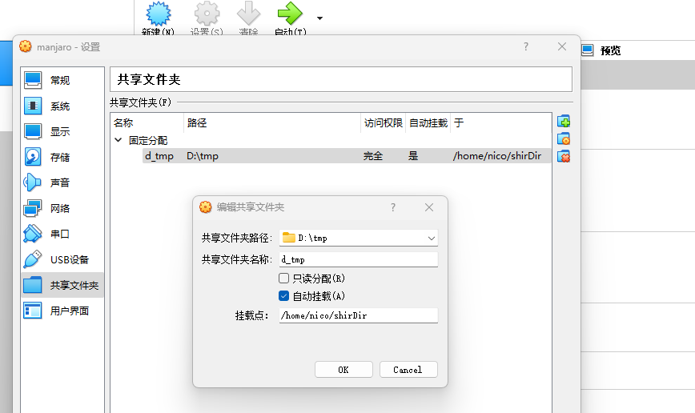

[TOC]

### [更换源](./01 Linux换源与更新.md)

### 按键映射


```bash
sudo apt install dconf-editor
dconf-editor
# 使用dconf-editor切换

# 使用gnome-teaks设置
sudo apt install gnome-tweaks
# 打开优化设置后->找到键盘设置->选择其他布局选项
```


### 基础

+ git

```bash
sudo apt-get install git
```

+ vim

```bash
sudo apt-get install vim
```

+ nvim：deb方式安装指定版本nvim

```bash
sudo apt remove neovim
sudo dpkg -i nvim-linux.deb
sudo apt install ./nvim-linux.deb
sudo apt autoremove
sudo apt install ./nvim-linux.deb
sudo chmod  nvim-linux.deb
sudo apt install ./nvim-linux.deb
nvim --version
```

### 星火商店

1、下载deb包

2、安装（apt，而不是apt-get）

```bash
sudo apt install ./spark-store_xxx.deb
```

### 终端配置

+ `flameshot`：截图工具1

```bash
# 安装
sudo apt install flameshot
```

+ `scrot`：截图工具2

```bash
sudo apt-get install scrot
# 截图
scrot -s temp.png
```


+ ranger：终端下目录管理

```bash
sudo apt-get install ranger
```

+ neofetch ：查看系统配置信息

```bash
sudo apt-get install neofetch
```

+ tree：查看目录树

```bash
sudo apt-get install tree
```

+ htop：系统资源使用实时监控

```bash
sudo apt-get install htop
```

+ `indicator-sysmonitor` 顶部显示系统利用率

```bash
 sudo add-apt-repository --remove ppa:fossfreedom/indicator-sysmonitor
 sudo apt-get update
 sudo apt-get install indicator-sysmonitor
 indicator-sysmonitor &
```

### 防火墙ufw

1、安装

```bash
sudo apt-get install ufw
```

2、规则添加

```bash
sudo ufw allow 8080
sudo ufw allow 8090
sudo ufw allow 8091
sudo ufw allow 587
sudo ufw allow 6379
sudo ufw allow 8081
sudo ufw allow 8082
sudo ufw allow 9876
sudo ufw allow 2181
sudo ufw allow 22
sudo ufw allow 7890
sudo ufw allow 31181
sudo ufw allow 8887
sudo ufw allow 10911
sudo ufw allow 55602
sudo ufw allow 10909
sudo ufw allow 15555
sudo ufw allow 9876
sudo ufw allow 10912
sudo ufw allow 10909
sudo ufw allow 7890
# sudo ufw allow from 192.168.1.1
```

3、查看规则

```bash
sudo ufw status verbose
```

### tabby 终端连接工具

```bash
sudo dpkg -i tabby-1.0.181-linux-x64.deb
sudo apt-get install ./tabby-1.0.181-linux-x64.deb
sudo apt-get --fix-broken install ./tabby-1.0.181-linux-x64.deb
rm tabby-1.0.181-linux-x64.deb
```

### 查找文件

+ fd

```bash
sudo apt-get install fd
```

+ fzf：终端下模糊搜索

```bash
sudo apt-get install fzf
```

### 文件管理器

+ sigma file manager

1、下载软件后，设置权限如图


2、安装依赖

```shell
-- ubuntu22.04
sudo apt install libfuse2
```

3、双击AppImage即可运行


+ lf

```bash
sudo apt-get install if
```

### 窗口管理器

+ i3

### 终端多任务

+ tmux

+ zellij

```bash
sudo apt-get install zellij
```

### OpenVPN
```shell
# 安装客户端
sudo apt install openvpn
# 启用客户端
openvpn /etc/openvpn/client.ovpn
# 可以用如下方式隐藏vpn启动的连接终端
openvpn /etc/openvpn/client.ovpn > /dev/null &
```
+ 配置：将配置文件移动到`/etc/openvpn`目录下

[配置详解](https://o-u-u.com/?p=2390)

### Clash


+ [参考1](https://www.alvinkwok.cn/2022/01/29/2022/01/Clash%20For%20Linux%20Install%20Guide/)

+ [参考2](https://juejin.cn/post/7127911250654134302)

> Ubuntu配置多个代理端口（如31181，7890）
> 新建`/etc/profile.d/proxy.sh`填写配置信息
> 
+ [参考链接](https://blog.csdn.net/u011119817/article/details/110856212)


### VirtualBOx


+ 

+ 
+ 

### Rust环境配置

1、配置环境变量

```bash
export RUSTUP_DIST_SERVER=https://mirrors.ustc.edu.cn/rust-static
export RUSTUP_UPDATE_ROOT=https://mirrors.ustc.edu.cn/rust-static/rustup
# 对应csh中的命令
# setenv RUSTUP_DIST_SERVER https://mirrors.ustc.edu.cn/rust-static
# setenv RUSTUP_UPDATE_ROOT https://mirrors.ustc.edu.cn/rust-static/rustup
```


2、安装

0、参考

```bash
$ export RUSTUP_DIST_SERVER=https://mirrors.ustc.edu.cn/rust-static
$ export RUSTUP_UPDATE_ROOT=https://mirrors.ustc.edu.cn/rust-static/rustup
$ sudo curl https://sh.rustup.rs -sSf | sh
info: downloading installer

Welcome to Rust!

This will download and install the official compiler for the Rust
programming language, and its package manager, Cargo.

Rustup metadata and toolchains will be installed into the Rustup
home directory, located at:

  /home/longqiping/.rustup

This can be modified with the RUSTUP_HOME environment variable.

The Cargo home directory located at:

  /home/longqiping/.cargo
This can be modified with the CARGO_HOME environment variable.

The cargo, rustc, rustup and other commands will be added to
Cargo's bin directory, located at:

  /home/longqiping/.cargo/bin

This path will then be added to your PATH environment variable by
modifying the profile files located at:

  /home/longqiping/.profile
  /home/longqiping/.bashrc

You can uninstall at any time with rustup self uninstall and
these changes will be reverted.

Current installation options:
   default host triple: aarch64-unknown-linux-gnu
     default toolchain: stable (default)
               profile: default
  modify PATH variable: yes

1) Proceed with installation (default)
2) Customize installation
3) Cancel installation
>1

info: profile set to 'default'
info: default host triple is aarch64-unknown-linux-gnu
info: syncing channel updates for 'stable-aarch64-unknown-linux-gnu'
info: latest update on 2021-02-11, rust version 1.50.0 (cb75ad5db 2021-02-10)
info: downloading component 'cargo'
info: downloading component 'clippy'
info: downloading component 'rust-docs'
info: downloading component 'rust-std'
 25.9 MiB /  25.9 MiB (100 %)  23.2 MiB/s in  1s ETA:  0s
info: downloading component 'rustc'
 76.5 MiB /  76.5 MiB (100 %)  12.5 MiB/s in  6s ETA:  0s
info: downloading component 'rustfmt'
info: installing component 'cargo'
info: using up to 500.0 MiB of RAM to unpack components
info: installing component 'clippy'
info: installing component 'rust-docs'
 14.6 MiB /  14.6 MiB (100 %)   8.8 MiB/s in  1s ETA:  0s
info: installing component 'rust-std'
 25.9 MiB /  25.9 MiB (100 %)  11.3 MiB/s in  2s ETA:  0s
info: installing component 'rustc'
 76.5 MiB /  76.5 MiB (100 %)  12.3 MiB/s in  6s ETA:  0s
info: installing component 'rustfmt'
info: default toolchain set to 'stable-aarch64-unknown-linux-gnu'

  stable-aarch64-unknown-linux-gnu installed - rustc 1.50.0 (cb75ad5db 2021-02-10)
Rust is installed now. Great!

To get started you need Cargo's bin directory ($HOME/.cargo/bin) in your PATH
environment variable. Next time you log in this will be done
automatically.

To configure your current shell, run:
source $HOME/.cargo/env
longqiping@ubuntu:~$ source $HOME/.cargo/env
longqiping@ubuntu:~$ cargo --version
cargo 1.50.0 (f04e7fab7 2021-02-04)
longqiping@ubuntu:~$ rustc --version
rustc 1.50.0 (cb75ad5db 2021-02-10)

longqiping@ubuntu:~$ cat .cargo/env
#!/bin/sh
# rustup shell setup
# affix colons on either side of $PATH to simplify matching
case ":${PATH}:" in
    *:"$HOME/.cargo/bin":*)
        ;;
    *)
        # Prepending path in case a system-installed rustc needs to be overridden
        export PATH="$HOME/.cargo/bin:$PATH"
        ;;
esac
```

+ [其他工具1](https://www.toutiao.com/article/7119508335744991778/?app=news_article&timestamp=1657682785&use_new_style=1&req_id=202207131126240101401711442031F2DA&group_id=7119508335744991778&share_token=bc014fe2-7e2b-42a2-ab3b-75029971bb61&source=m_redirect&wid=1657683376558)