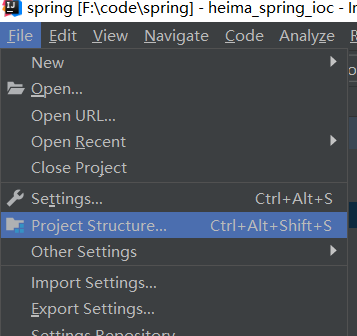

+ [参考1](https://blog.lupf.cn/articles/2022/07/27/1658901515446.html)
+ [参考2](https://zhile.io/2021/11/29/ja-netfilter-javaagent-lib.html)
+ [参考3](https://blog.csdn.net/qq_34707272/article/details/119973456)
+ [参考4](https://www.cnblogs.com/LzsCxb/p/15691203.html)

## 项目创建

+ Do you want to add the following file to Git?（git add） [参考链接]([phpstorm Do you want to add the following file to Git?_liuqun of program life-CSDN博客](https://blog.csdn.net/liuqun0319/article/details/114118498))

+ 窗口上多行展示所有类

