- [vscode](#vscode)
- [IDEA](#idea)
  - [1. 进入设置](#1-进入设置)
  - [2. 主题更改](#2-主题更改)
  - [3. 编辑区字体大小（用ctrl+滚轮方式）](#3-编辑区字体大小用ctrl滚轮方式)
  - [4. 自动导包和优化多余的包](#4-自动导包和优化多余的包)
  - [5. 同一包下的类，超过指定个数时合并为*](#5-同一包下的类超过指定个数时合并为)
  - [6. 显示行号，类中方法间隔开](#6-显示行号类中方法间隔开)
  - [7. 忽略大小写进行提示](#7-忽略大小写进行提示)
  - [8. 多个类不单行隐藏](#8-多个类不单行隐藏)
  - [9. 设置默认字体与行间距（编辑区与控制台一起）](#9-设置默认字体与行间距编辑区与控制台一起)
  - [10. 修改注释颜色](#10-修改注释颜色)
  - [11. 修改类头部的注释信息](#11-修改类头部的注释信息)
  - [12. 设置编码格式](#12-设置编码格式)
  - [13. 进行自动编译](#13-进行自动编译)
  - [14. 省电模式](#14-省电模式)
  - [15. 代码垂直/水平展示](#15-代码垂直水平展示)
  - [16. 导入指定文件夹下的jar包到指定项目](#16-导入指定文件夹下的jar包到指定项目)
  - [17. 生成序列化版本号](#17-生成序列化版本号)
- [IDEA 快捷键](#idea-快捷键)
  - [1. 代码模板](#1-代码模板)
  - [2. 断点](#2-断点)
  - [3. 创建Javaweb项目](#3-创建javaweb项目)
- [idea快捷键大全](#idea快捷键大全（win）)
- [Pycharm](#pycharm)
- [VS studio](#vs-studio)

## vscode

## IDEA

### IDEA激活

+ [参考1](https://blog.lupf.cn/articles/2022/07/27/1658901515446.html)
+ [参考2](https://zhile.io/2021/11/29/ja-netfilter-javaagent-lib.html)
+ [参考3](https://blog.csdn.net/qq_34707272/article/details/119973456)
+ [参考4](https://www.cnblogs.com/LzsCxb/p/15691203.html)


## 项目创建

+ Do you want to add the following file to Git?（git add） [参考链接]([phpstorm Do you want to add the following file to Git?_liuqun of program life-CSDN博客](https://blog.csdn.net/liuqun0319/article/details/114118498))

+ 窗口上多行展示所有类

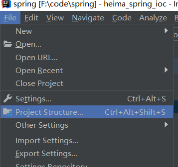


### IDEA调试

+ 快捷键

> + F8 : 逐行执行程序
> + F7 : 进入到方法中
> + Shift+F8 : 跳出方法
> + F9 : 跳到下一个断点（如果没有断点则停止程序）
> + Ctrl+F2 : 推出debug模式，停止程序

+ 打上断点后运行，程序会运行到断点行处（本行不执行）

> IDEA中的一个moudle相当于eclipse的一个project，有单独的src文件夹而可以单独运行
>
> 而IDEA的一个project是一个大的工作空间，相当于eclipse的一个workplace，可用于包含多个可单独运行的moudle

## 详细设置

### 1. 进入设置

### 2. 主题更改

### 3. 编辑区字体大小（用ctrl+滚轮方式）

### 4. 自动导包和优化多余的包

+ 手动快捷键：alt+enter

### 5. 注释时//不在第一列，合代码对齐

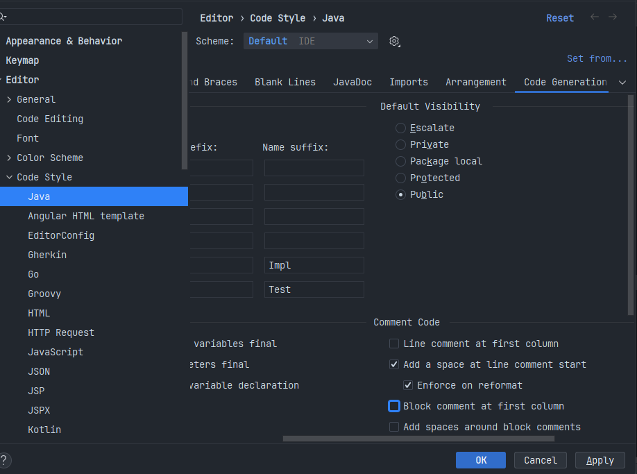

### 6. 显示行号，类中方法间隔开 

### 7. 忽略大小写进行提示

### 8. 多个类不单行隐藏

### 9. 设置默认字体与行间距（编辑区与控制台一起）

### 10. 修改注释颜色

### 11. 修改类头部的注释信息

```java
/**
*   @Author: licretey
*   @Date: ${DATE} - ${MONTH} - ${DAY} - ${TIME}
*   @Description: ${PACKAGE_NAME}
*   @Version: 1.0
*/
```

+ 仅对新建的类有效

### 12. 设置编码格式

+ 使用encod搜索找到的地方都设置为utf-8

### 13. 进行自动编译 

### 14. 省电模式

> 当代码提示之类的没有时可能进入省电模式了，取消勾选即可

### 15. 代码垂直/水平展示

### 16. 导入指定文件夹下的jar包到指定项目


### 17. 生成序列化版本号

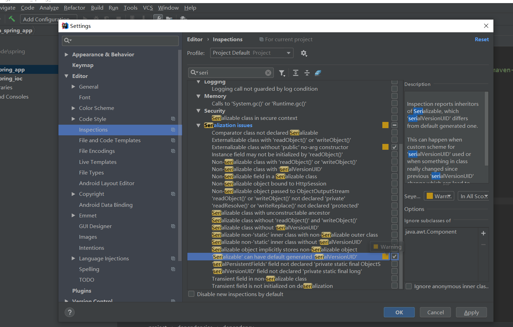

### IDEA 快捷键

### IDEA 优化

+ 开启多线程编译

+ 优化参数
```
-Xms192m
-Xmx8192m
-XX:ReservedCodeCacheSize=1024m
-XX:+UseG1GC
-XX:SoftRefLRUPolicyMSPerMB=50
-XX:CICompilerCount=2
-XX:+HeapDumpOnOutOfMemoryError
-XX:-OmitStackTraceInFastThrow
-Dide.managed.by.toolbox=C:\Users\yang\AppData\Local\JetBrains\Toolbox\bin\jetbrains-toolbox.exe
-Dtoolbox.notification.token=fc3fc812-3ffa-4c06-b595-971e3c6d20a8
-Dtoolbox.notification.portFile=C:\Users\yang\AppData\Local\JetBrains\Toolbox\cache\ports\902106684.port
```


> Idea的配置：字体和补全功能
>
> Idea的快捷键：
> | 快捷键             | 功能                                   |
> | ------------------ | -------------------------------------- |
> | alt+enter          | 导入包，自动修正代码                   |
> | ctrl+y             | 删除光标所在行                         |
> | ctrl+d             | 复制光标所在行的内容，插入光标位置下面 |
> | ctrl+alt+L         | 格式化代码                             |
> | ctrl+/             | 单行注释，再按取消注释                 |
> | ctrl+shift+/       | 选中代码注释，多行注释，再按取消注释   |
> | alt+Ins            | 自动生成代码，toString/get/set等方法   |
> | alt+shift+上下箭头 | 移动当前代码行                         |
> | shift+f6           | 批量修改方法中的同名变量               |
> | ctrl+alt+m         | 对选中的代码块快速封装为一个方法       |

+ idea中写for循环：n.fori然后确定即可
+ idea下写标准类的快捷方式：按下alt+insert选择要生成的函数，接着选择参数，然后生成


alt+insert ： 创建内容捷键键（新建xxx）

psvm：main方法

sout：system.out.print()

ctrl+d：复制并粘贴一行

ctrl+y： 删除一行

ctrl+shift+upon/down：选中代码上移/下移

ctrl+z：撤回操作

ctrl+shift+z：重复操作（redo）

ctrl+n：搜索类

alt+insert：生成代码

alt+enter：手动导包，生成变量等

ctrl+/ 或ctrl+shift+/：单行注释或多行注释

shift+6：重命名

fori 回车：for循环

ctrl + alt +t：选中代码块放入包围

alt+/：代码自动补全（原为ctrl+空格，手动设置为alt+/）

ctrl+鼠标点击：代码层层调用快捷键（查看底层源码）

ctrl+alt+←/→：可以完成对层层代码的前进与后退（本机与系统快捷键冲突）

alt+子视窗数字：打开关闭各个子视窗快捷键


udea中窗口最大化---->Windows 上： Ctrl+Shift+F12


ctrl+z撤回代码

ctrl+shift+z恢复撤回代码

ctrl + Alt + V (返回属性变量)

shift+ctrl+u (大小写的切换)

Ctrl+Alt+L，格式化代码

Ctrl+D 将当前行复制到下一行

Ctrl+Alt+T，可以把代码包在一个块内，例如：try/catch 也可抛错误

：抛异常  鼠标放在编译异常的位置 + \Alt+Enter\

：快捷方式一（光标移到该代码行，Alt+Enter），可以异常外抛出，也可以try-catch：

Ctrl+Shift+Space，自动补全代码（提示）

Ctrl+O，重写方法

Ctrl+I，实现方法

itar 生成array for代码块

iter 生成增强for

itli 生成List的遍历

itit 生成iterator 迭代

自定义的注释模板(自定义)：M+Tab
自定义的注释方法模板\(自定义)\：r+Tab
ctrl + shift + enter 句末加；

连安两下 shift 查找文件

CtrL +shift +r 全局搜索：

ctrl +r 替换当前页的单词

代码格式化： shfit + G\(自定义)\ //ctrl +alt +L

直接查看和进入接口实现类的快捷键：   Ctrl+Alt+鼠标左键

单机两下放大窗户：alt+capslk(大小写切换)+鼠标左键  或者：ALT + \鼠标左键\   列编辑模式

对象+.+new +enter +.+var   new 对象

ctrl+shift+enter不只是用来行尾加分号的；

idea进阶快捷键：

 

1 查看接口的实现类：Ctrl+Alt+B：


2：查看一个类中有什么方法：Alt+7 或 点左侧边栏Structure


2 返回上/下个光标地方:Alt+Ctrl+箭头(向左) 和 Alt+ Ctrl+箭头(向右)---（全键盘）


而本机为:Alt+Ctrl+Pgup和Alt+Ctrl+Down


3： 查看Java方法调用树(被调/主调)：Ctrl+Alt+H


5 :查看类继承关系图：Ctrl+Alt+U


6:查看当前类的继承树：Ctrl+H


7: 查看定义的变量在哪里被调用：Ctrl+Alt+F7


查看一个类中有什么方法：Alt+7 或 点左侧边栏Structure

 列编辑 alt +左键

自动生成not null判断语句 .notnull


### idea快捷键大全（win）

Ctrl
快捷键	介绍
Ctrl + F	在当前文件进行文本查找 （必备）
Ctrl + R	在当前文件进行文本替换 （必备）
Ctrl + Z	撤销 （必备）
Ctrl + Y	删除光标所在行 或 删除选中的行 （必备）
Ctrl + X	剪切光标所在行 或 剪切选择内容
Ctrl + C	复制光标所在行 或 复制选择内容
Ctrl + D	复制光标所在行 或 复制选择内容，并把复制内容插入光标位置下面 （必备）
Ctrl + W	递进式选择代码块。可选中光标所在的单词或段落，连续按会在原有选中的基础上再扩展选中范围 （必备）
Ctrl + E	显示最近打开的文件记录列表
Ctrl + N	根据输入的 类名 查找类文件
Ctrl + G	在当前文件跳转到指定行处
Ctrl + J	插入自定义动态代码模板
Ctrl + P	方法参数提示显示
Ctrl + Q	光标所在的变量 / 类名 / 方法名等上面（也可以在提示补充的时候按），显示文档内容
Ctrl + U	前往当前光标所在的方法的父类的方法 / 接口定义
Ctrl + B	进入光标所在的方法/变量的接口或是定义出，等效于 Ctrl + 左键单击
Ctrl + K	版本控制提交项目，需要此项目有加入到版本控制才可用
Ctrl + T	版本控制更新项目，需要此项目有加入到版本控制才可用
Ctrl + H	显示当前类的层次结构
Ctrl + O	选择可重写的方法
Ctrl + I	选择可继承的方法
Ctrl + +	展开代码
Ctrl + -	折叠代码
Ctrl + /	注释光标所在行代码，会根据当前不同文件类型使用不同的注释符号 （必备）
Ctrl + [	移动光标到当前所在代码的花括号开始位置
Ctrl + ]	移动光标到当前所在代码的花括号结束位置
Ctrl + F1	在光标所在的错误代码出显示错误信息
Ctrl + F3	调转到所选中的词的下一个引用位置
Ctrl + F4	关闭当前编辑文件
Ctrl + F8	在 Debug 模式下，设置光标当前行为断点，如果当前已经是断点则去掉断点
Ctrl + F9	执行 Make Project 操作
Ctrl + F11	选中文件 / 文件夹，使用助记符设定 / 取消书签
Ctrl + F12	弹出当前文件结构层，可以在弹出的层上直接输入，进行筛选
Ctrl + Tab	编辑窗口切换，如果在切换的过程又加按上delete，则是关闭对应选中的窗口
Ctrl + Enter	智能分隔行
Ctrl + End	跳到文件尾
Ctrl + Home	跳到文件头
Ctrl + Space	基础代码补全，默认在 Windows 系统上被输入法占用，需要进行修改，建议修改为 Ctrl + 逗号 （必备）
Ctrl + Delete	删除光标后面的单词或是中文句
Ctrl + BackSpace	删除光标前面的单词或是中文句
Ctrl + 1,2,3...9	定位到对应数值的书签位置
Ctrl + 左键单击	在打开的文件标题上，弹出该文件路径
Ctrl + 光标定位	按 Ctrl 不要松开，会显示光标所在的类信息摘要
Ctrl + 左方向键	光标跳转到当前单词 / 中文句的左侧开头位置
Ctrl + 右方向键	光标跳转到当前单词 / 中文句的右侧开头位置
Ctrl + 前方向键	等效于鼠标滚轮向前效果
Ctrl + 后方向键	等效于鼠标滚轮向后效果
Alt
快捷键	介绍
Alt + `	显示版本控制常用操作菜单弹出层
Alt + Q	弹出一个提示，显示当前类的声明 / 上下文信息
Alt + F1	显示当前文件选择目标弹出层，弹出层中有很多目标可以进行选择
Alt + F2	对于前面页面，显示各类浏览器打开目标选择弹出层
Alt + F3	选中文本，逐个往下查找相同文本，并高亮显示
Alt + F7	查找光标所在的方法 / 变量 / 类被调用的地方
Alt + F8	在 Debug 的状态下，选中对象，弹出可输入计算表达式调试框，查看该输入内容的调试结果
Alt + Home	定位 / 显示到当前文件的 Navigation Bar
Alt + Enter	IntelliJ IDEA 根据光标所在问题，提供快速修复选择，光标放在的位置不同提示的结果也不同 （必备）
Alt + Insert	代码自动生成，如生成对象的 set / get 方法，构造函数，toString() 等
Alt + 左方向键	按左方向切换当前已打开的文件视图
Alt + 右方向键	按右方向切换当前已打开的文件视图
Alt + 前方向键	当前光标跳转到当前文件的前一个方法名位置
Alt + 后方向键	当前光标跳转到当前文件的后一个方法名位置
Alt + 1,2,3...9	显示对应数值的选项卡，其中 1 是 Project 用得最多
Shift
快捷键	介绍
Shift + F1	如果有外部文档可以连接外部文档
Shift + F2	跳转到上一个高亮错误 或 警告位置
Shift + F3	在查找模式下，查找匹配上一个
Shift + F4	对当前打开的文件，使用新Windows窗口打开，旧窗口保留
Shift + F6	对文件 / 文件夹 重命名
Shift + F7	在 Debug 模式下，智能步入。断点所在行上有多个方法调用，会弹出进入哪个方法
Shift + F8	在 Debug 模式下，跳出，表现出来的效果跟 F9 一样
Shift + F9	等效于点击工具栏的 Debug 按钮
Shift + F10	等效于点击工具栏的 Run 按钮
Shift + F11	弹出书签显示层
Shift + Tab	取消缩进
Shift + ESC	隐藏当前 或 最后一个激活的工具窗口
Shift + End	选中光标到当前行尾位置
Shift + Home	选中光标到当前行头位置
Shift + Enter	开始新一行。光标所在行下空出一行，光标定位到新行位置
Shift + 左键单击	在打开的文件名上按此快捷键，可以关闭当前打开文件
Shift + 滚轮前后滚动	当前文件的横向滚动轴滚动
Ctrl + Alt
快捷键	介绍
Ctrl + Alt + L	格式化代码，可以对当前文件和整个包目录使用 （必备）
Ctrl + Alt + O	优化导入的类，可以对当前文件和整个包目录使用 （必备）
Ctrl + Alt + I	光标所在行 或 选中部分进行自动代码缩进，有点类似格式化
Ctrl + Alt + T	对选中的代码弹出环绕选项弹出层
Ctrl + Alt + J	弹出模板选择窗口，讲选定的代码加入动态模板中
Ctrl + Alt + H	调用层次
Ctrl + Alt + B	在某个调用的方法名上使用会跳到具体的实现处，可以跳过接口
Ctrl + Alt + V	快速引进变量
Ctrl + Alt + Y	同步、刷新
Ctrl + Alt + S	打开 IntelliJ IDEA 系统设置
Ctrl + Alt + F7	显示使用的地方。寻找被该类或是变量被调用的地方，用弹出框的方式找出来
Ctrl + Alt + F11	切换全屏模式
Ctrl + Alt + Enter	光标所在行上空出一行，光标定位到新行
Ctrl + Alt + Home	弹出跟当前文件有关联的文件弹出层
Ctrl + Alt + Space	类名自动完成
Ctrl + Alt + 左方向键	退回到上一个操作的地方 （必备）（注意与其他软件快捷键冲突）
Ctrl + Alt + 右方向键	前进到上一个操作的地方 （必备）（注意与其他软件快捷键冲突）
Ctrl + Alt + 前方向键	在查找模式下，跳到上个查找的文件
Ctrl + Alt + 后方向键	在查找模式下，跳到下个查找的文件
Ctrl + Shift
快捷键	介绍
Ctrl + Shift + F	根据输入内容查找整个项目 或 指定目录内文件 （必备）
Ctrl + Shift + R	根据输入内容替换对应内容，范围为整个项目 或 指定目录内文件 （必备）
Ctrl + Shift + J	自动将下一行合并到当前行末尾 （必备）
Ctrl + Shift + Z	取消撤销 （必备）
Ctrl + Shift + W	递进式取消选择代码块。可选中光标所在的单词或段落，连续按会在原有选中的基础上再扩展取消选中范围 （必备）
Ctrl + Shift + N	通过文件名定位 / 打开文件 / 目录，打开目录需要在输入的内容后面多加一个正斜杠 （必备）
Ctrl + Shift + U	对选中的代码进行大 / 小写轮流转换 （必备）
Ctrl + Shift + T	对当前类生成单元测试类，如果已经存在的单元测试类则可以进行选择
Ctrl + Shift + C	复制当前文件磁盘路径到剪贴板
Ctrl + Shift + V	弹出缓存的最近拷贝的内容管理器弹出层
Ctrl + Shift + E	显示最近修改的文件列表的弹出层
Ctrl + Shift + H	显示方法层次结构
Ctrl + Shift + B	跳转到类型声明处
Ctrl + Shift + I	快速查看光标所在的方法 或 类的定义
Ctrl + Shift + A	查找动作 / 设置
Ctrl + Shift + /	代码块注释 （必备）
Ctrl + Shift + [	选中从光标所在位置到它的顶部中括号位置
Ctrl + Shift + ]	选中从光标所在位置到它的底部中括号位置
Ctrl + Shift + +	展开所有代码
Ctrl + Shift + -	折叠所有代码
Ctrl + Shift + F7	高亮显示所有该选中文本，按Esc高亮消失
Ctrl + Shift + F8	在 Debug 模式下，指定断点进入条件
Ctrl + Shift + F9	编译选中的文件 / 包 / Module
Ctrl + Shift + F12	编辑器最大化
Ctrl + Shift + Space	智能代码提示
Ctrl + Shift + Enter	自动结束代码，行末自动添加分号 （必备）
Ctrl + Shift + Backspace	退回到上次修改的地方
Ctrl + Shift + 1,2,3...9	快速添加指定数值的书签
Ctrl + Shift + 左方向键	在代码文件上，光标跳转到当前单词 / 中文句的左侧开头位置，同时选中该单词 / 中文句
Ctrl + Shift + 右方向键	在代码文件上，光标跳转到当前单词 / 中文句的右侧开头位置，同时选中该单词 / 中文句
Ctrl + Shift + 左方向键	在光标焦点是在工具选项卡上，缩小选项卡区域
Ctrl + Shift + 右方向键	在光标焦点是在工具选项卡上，扩大选项卡区域
Ctrl + Shift + 前方向键	光标放在方法名上，将方法移动到上一个方法前面，调整方法排序
Ctrl + Shift + 后方向键	光标放在方法名上，将方法移动到下一个方法前面，调整方法排序
Alt + Shift
快捷键	介绍
Alt + Shift + N	选择 / 添加 task
Alt + Shift + F	显示添加到收藏夹弹出层
Alt + Shift + C	查看最近操作项目的变化情况列表
Alt + Shift + F	添加到收藏夹
Alt + Shift + I	查看项目当前文件
Alt + Shift + F7	在 Debug 模式下，下一步，进入当前方法体内，如果方法体还有方法，则会进入该内嵌的方法中，依此循环进入
Alt + Shift + F9	弹出 Debug 的可选择菜单
Alt + Shift + F10	弹出 Run 的可选择菜单
Alt + Shift + 左键双击	选择被双击的单词 / 中文句，按住不放，可以同时选择其他单词 / 中文句
Alt + Shift + 前方向键	移动光标所在行向上移动
Alt + Shift + 后方向键	移动光标所在行向下移动
Ctrl + Shift + Alt
快捷键	介绍
Ctrl + Shift + Alt + V	无格式黏贴
Ctrl + Shift + Alt + N	前往指定的变量 / 方法
Ctrl + Shift + Alt + S	打开当前项目设置
Ctrl + Shift + Alt + C	复制参考信息
**其他**
快捷键	介绍
F2	跳转到下一个高亮错误 或 警告位置 （必备）
F3	在查找模式下，定位到下一个匹配处
F4	编辑源
F7	在 Debug 模式下，进入下一步，如果当前行断点是一个方法，则进入当前方法体内，如果该方法体还有方法，则不会进入该内嵌的方法中
F8	在 Debug 模式下，进入下一步，如果当前行断点是一个方法，则不进入当前方法体内
F9	在 Debug 模式下，恢复程序运行，但是如果该断点下面代码还有断点则停在下一个断点上
F11	添加书签
F12	回到前一个工具窗口
Tab	缩进
ESC	从工具窗口进入代码文件窗口
连按两次Shift	弹出 Search Everywhere 弹出层

#### 1. 代码模板

>设置一些字母缩写可自动生成部分固定的代码
>
>+ live实时模板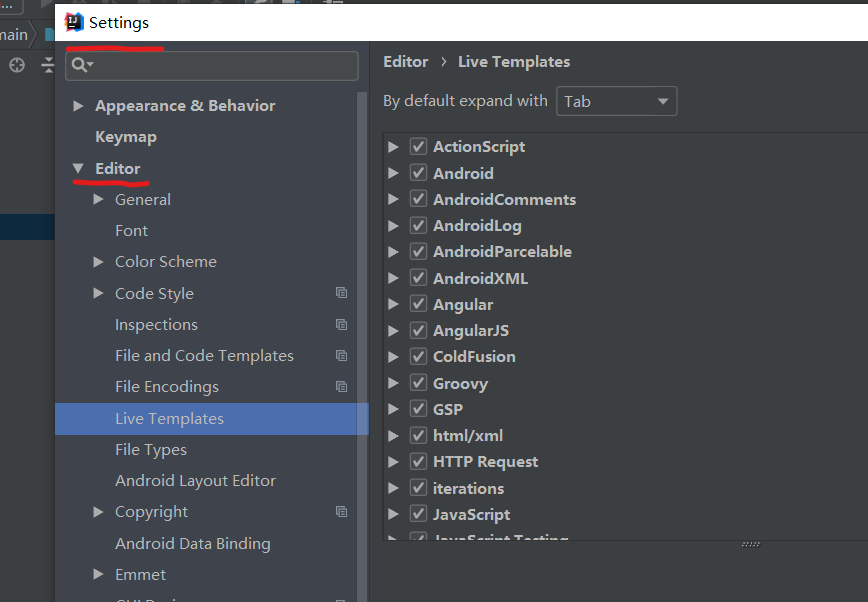
>+ postfix配置模板（通过后缀）

常用代码模板：

+ psvm/main
+ sout
  + soutp
  + soutm
  + soutv
+ fori / .fori  /  .forr
+ iter / .for：增强for循环
+ ifn / .null
+ inn / .nn
+ prsf：private static final
+ psf：public static final

修改代码模板

#### 2. 断点

+ [参考链接](https://mp.weixin.qq.com/s/5xysNwOIl7DhSUSTS53wTg)

设置：专门针对windows，省内存

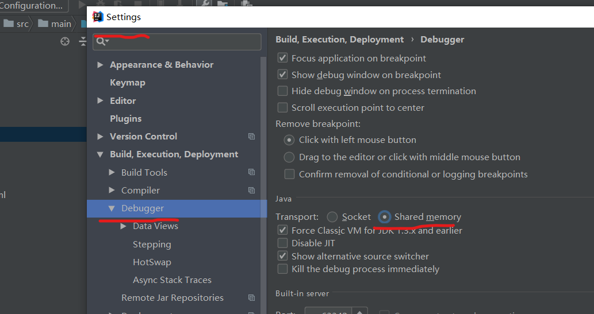

+ 解释

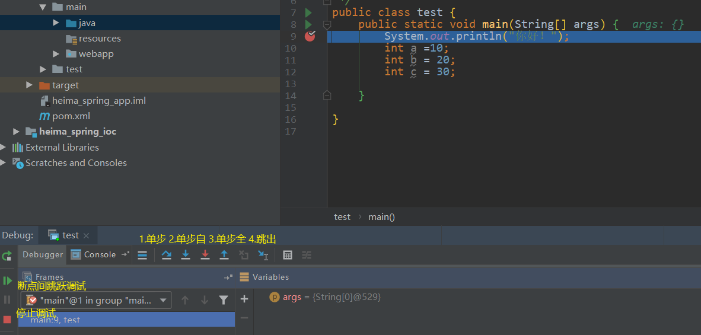

> 1.单步：仅仅一步步向下执行，不会进入自定义函数也不会进入系统类库的方法中
>
> 2.单步自：一步步向下执行，但会进入自定义函数而不会进入系统类库的方法中
>
> 3.单步全：一步步向下执行，即会进入自定义函数也会进入系统类库的方法中

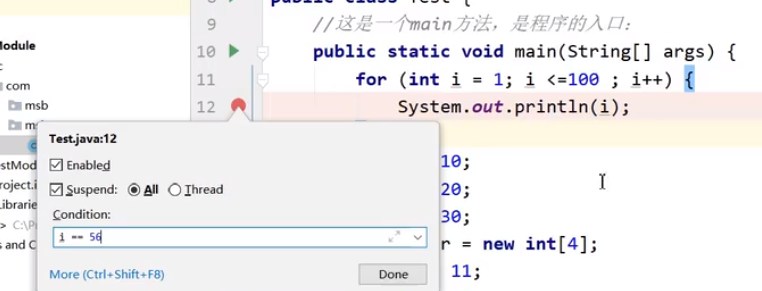

> 让一步步执行的调试跳转到指定条件下停止（右键点击红点配置）

#### 3. 创建Javaweb项目

+ [**1.创建maven项目参考**](https://www.cnblogs.com/shuaishuai1993/p/9795227.html)
+ [**2.部署web项目参考**](https://www.cnblogs.com/1314wamm/p/7475771.html)

+ 创建module

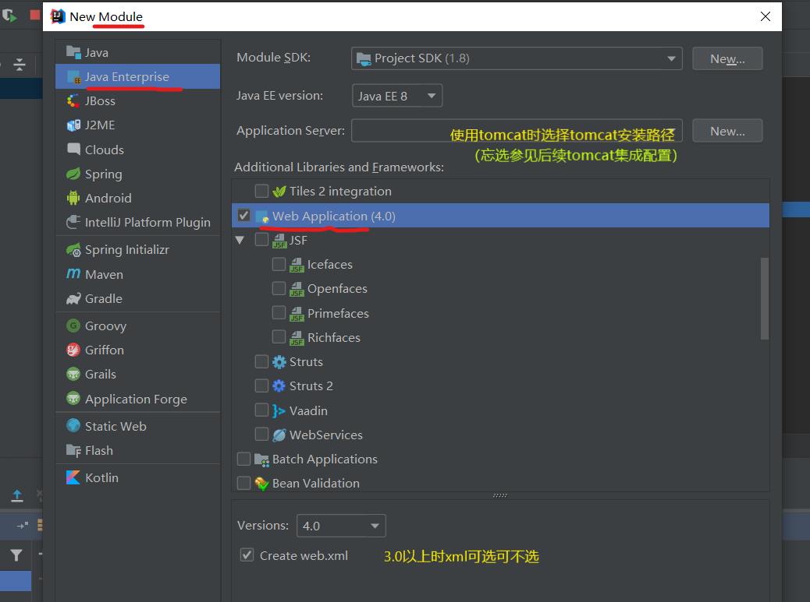

+ tomcat镜像集成配置

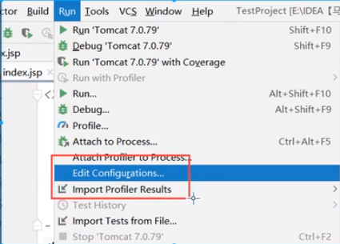

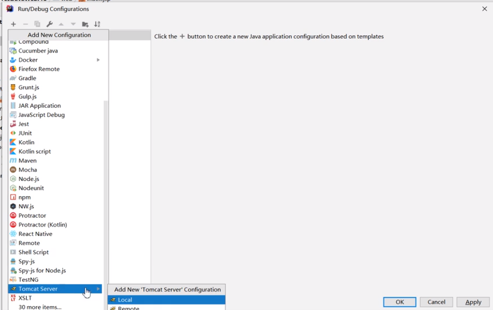

> 添加镜像

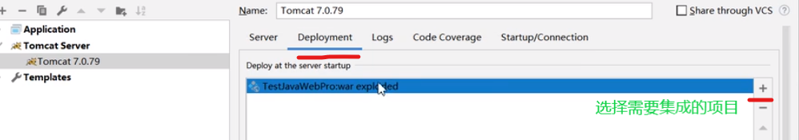

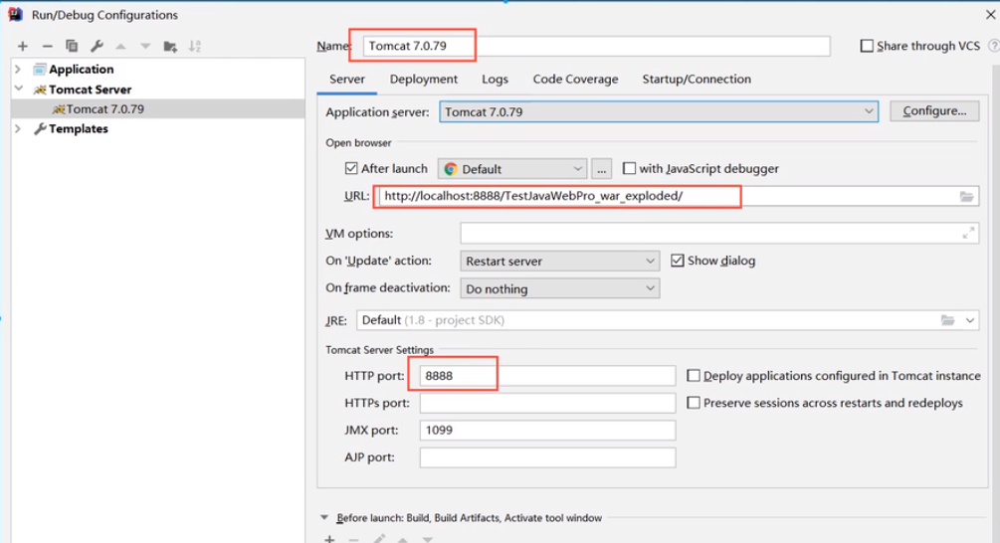

> 配置镜像

**本质上是idea将本地的tomcat制作一个单一的镜像交给一个对应的项目，这个镜像脱离本地镜像而存在且与其它项目中的镜像相区别**

## Pycharm

## VS studio