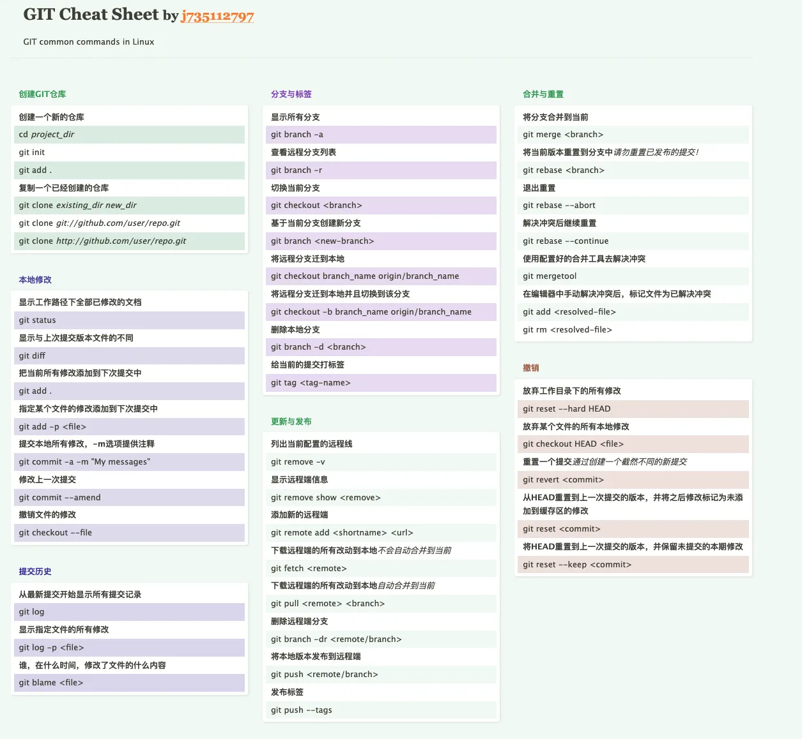
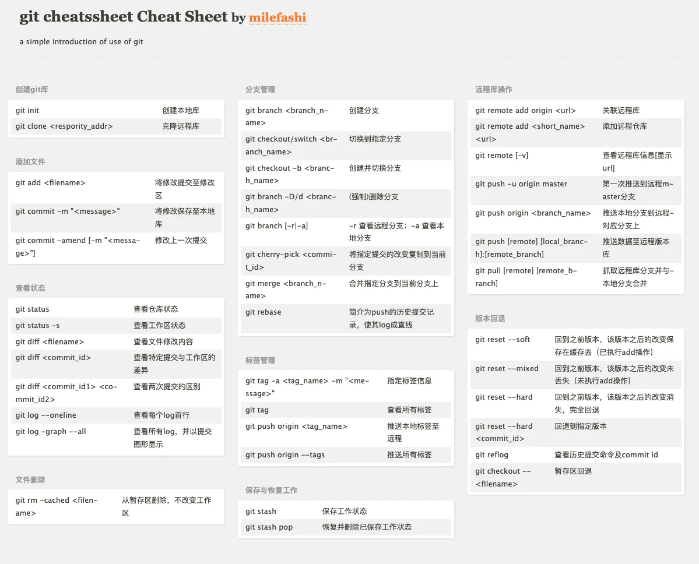

+ 总结2

### idea-git回退方案

[鱼乐](https://www.zhihu.com/people/yu-le-52-95)

第一种方案(不保留提交记录，速度快)：

方法一：

1、右键项目>git>show history>找到需要回退的版本>Select in git log>Reset current branch to Here

此时会出现回退的方式：

soft：保留工作区及暂存区的修改，

mixed:保留工作区的修改，清除暂存区

Hard：不保留修改，直接回退到所选版本

**2、push选择Force push（强推）**

方法二：

1、右键项目>git>show history>找到需要回退的版本>copy revision number

2、git>reset head>to Commit :填写copy的revision number

3、之后强推

第二种方案(保留提交记录，速度慢)推荐

1、右键项目-git-show history-找到需要回退的版本-Select in git log-new branch-push

2、右键项目-git-show history-找到需要回退的版本-Select in git log-revert-处理掉冲突-push（注意必须每个分支进行revert）

3、最后再合到master分支

4、其他人更新一下代码就可以了