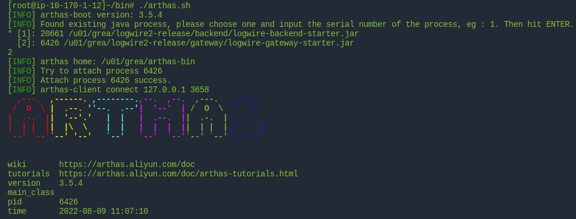
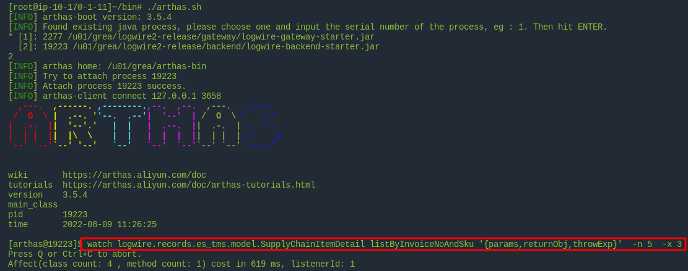

+ Bug背景

> UAT上的发货通知页面中有条数据想修改发票号，而发货通知的保存时会校验明细的SKU，它的规则是根据发货通知的**发票号+明细的SKU**码到SupplyChainItemDetail中查看是否存在，所以修改发票号需要一同修改明细数据

+ 我的动作是删除旧数据，修改发票号后新增对应的发票号下的SKU数据，但保存时一直在`throw ctx.newI18nException("invalid_sku");`处抛异常
+ 保存校验代码如下

```java
if(recordListMap.toString().contains("SCOrderDetail")) {
    RecordList orderDetail = recordListMap.get("SCOrderDetail");
    List<? extends Record> detailRecords = orderDetail.getRecords();
    detailRecords.forEach(record -> {
        SupplyChainOrderReleaseDetail detail = (SupplyChainOrderReleaseDetail) record;
        //校验SKU
        SupplyChainSku sku = SupplyChainSku.findById(ctx, detail.getSupplyChainSku());
        SizableIterable<SupplyChainItemDetail> items = SupplyChainItemDetail.listByInvoiceNoAndSku(ctx, order.getInvoiceNo(), sku.getSku());
        if(items.size()<1){
            throw ctx.newI18nException("invalid_sku");
        }
        detail.setSupplyChainOrderRelease(hearderId);
    });
    queryService.save(ctx,detailRecords);
}
```

+ 所以进行了如下调试（不确定打到哪里了，所以两台机子都开了arthas）
+ 1、先进入UAT中，执行如下脚本打开Arthas



+ 2、选择我们项目的backend进程对应的编号，我这里是2
+ 3、执行如下arthas命令

```shell
sh ~/bin/arthas.sh
# 内容如下
# java -jar /u01/grea/arthas-bin/arthas-boot.jar
```

> 可以在idea中安装`arthas idea`插件，找到方法后直接生成需要的命令

```shell
# 监听SupplyChainItemDetail.listByInvoiceNoAndSku方法，查看入参和查询的返回结果、异常
watch logwire.records.es_tms.model.SupplyChainItemDetail listByInvoiceNoAndSku '{params,returnObj,throwExp}'  -n 5  -x 3 
```



+ 再次保存后监听到的结果如下（没监听到多试几次）

```shell
[arthas@13429]$ watch logwire.records.es_tms.model.SupplyChainItemDetail listByInvoiceNoAndSku '{params,returnObj,throwExp}'  -n 5  -x 3
Press Q or Ctrl+C to abort.
Affect(class count: 4 , method count: 1) cost in 544 ms, listenerId: 1
method=logwire.records.es_tms.model.SupplyChainItemDetail.listByInvoiceNoAndSku location=AtExit
ts=2022-08-08 17:20:28; [cost=6.796795ms] result=@ArrayList[
    @Object[][
        @ContextImpl[
            logger=@Logger[Logger[logwire.core.context.ContextImpl]],
            NAMESPACE=@ThreadLocal[java.lang.ThreadLocal@428f4204],
            TRANSACTION_BROKEN=@ThreadLocal[java.lang.ThreadLocal@59749b66],
            queryAutoNumberUpdater=@AtomicIntegerFieldUpdaterImpl[java.util.concurrent.atomic.AtomicIntegerFieldUpdater$AtomicIntegerFieldUpdaterImpl@5458a0e],
            referenceCountUpdater=@AtomicIntegerFieldUpdaterImpl[java.util.concurrent.atomic.AtomicIntegerFieldUpdater$AtomicIntegerFieldUpdaterImpl@7134f974],
            sessionId=@String[a6888d385a5145365c9ae63cf2764568],
            tenantUser=@TenantUserImpl[logwire.core.context.TenantUserImpl@49130a34],
            archiveKey=null,
            cleanTasks=@ArrayList[isEmpty=false;size=1],
            coreStatus=@Boolean[false],
            traceId=@String[d3b942ff751442289531cfc928d5f3f1],
            messageRequest=@MessageRequest[logwire.common.transport.MessageRequest@344117db],
            runtimeContext=@TenantProjectImpl[logwire.core.context.TenantProjectImpl@1d7dfea7],
            cancelTasks=@ConcurrentHashMap[isEmpty=false;size=1],
            queryAutoNumber=@Integer[0],
            referenceCount=@Integer[1],
            status=@CancelReason[LIVING],
            attributes=@ConcurrentHashMap[isEmpty=false;size=1],
        ],
        @String[LGiLE-Q-QMD-095-02],
        @String[TSM-490DEG18MC.21(II)],
    ],
    @SizableIterableImpl[
        BUFFER_SIZE=@Integer[1000],
        ctx=@ContextImpl[
            logger=@Logger[Logger[logwire.core.context.ContextImpl]],
            NAMESPACE=@ThreadLocal[java.lang.ThreadLocal@428f4204],
            TRANSACTION_BROKEN=@ThreadLocal[java.lang.ThreadLocal@59749b66],
            queryAutoNumberUpdater=@AtomicIntegerFieldUpdaterImpl[java.util.concurrent.atomic.AtomicIntegerFieldUpdater$AtomicIntegerFieldUpdaterImpl@5458a0e],
            referenceCountUpdater=@AtomicIntegerFieldUpdaterImpl[java.util.concurrent.atomic.AtomicIntegerFieldUpdater$AtomicIntegerFieldUpdaterImpl@7134f974],
            sessionId=@String[a6888d385a5145365c9ae63cf2764568],
            tenantUser=@TenantUserImpl[logwire.core.context.TenantUserImpl@49130a34],
            archiveKey=null,
            cleanTasks=@ArrayList[isEmpty=false;size=1],
            coreStatus=@Boolean[false],
            traceId=@String[d3b942ff751442289531cfc928d5f3f1],
            messageRequest=@MessageRequest[logwire.common.transport.MessageRequest@344117db],
            runtimeContext=@TenantProjectImpl[logwire.core.context.TenantProjectImpl@1d7dfea7],
            cancelTasks=@ConcurrentHashMap[isEmpty=false;size=1],
            queryAutoNumber=@Integer[0],
            referenceCount=@Integer[1],
            status=@CancelReason[LIVING],
            attributes=@ConcurrentHashMap[isEmpty=false;size=1],
        ],
        writeList=@ArrayList[isEmpty=true;size=0],
        readFiles=@ArrayList[isEmpty=true;size=0],
        tempFile=null,
        writeIndex=@Integer[0],
        iterated=@Boolean[false],
        writeFile=null,
        fileIteratorFunction=@SizableIterableImpl$$Lambda$994/355025006[
            arg$1=@SizableIterableImpl[logwire.core.support.SizableIterableImpl@4b545b25],
            arg$2=@RecordService[logwire.core.database.RecordService@1a47aad1],
            arg$3=@Class[interface logwire.records.es_tms.model.SupplyChainItemDetail],
        ],
        memoryIteratorFunction=@SizableIterableImpl$$Lambda$994/355025006[
            arg$1=@SizableIterableImpl[logwire.core.support.SizableIterableImpl@4b545b25],
            arg$2=@RecordService[logwire.core.database.RecordService@1a47aad1],
            arg$3=@Class[interface logwire.records.es_tms.model.SupplyChainItemDetail],
        ],
    ],
    null,
]
session (3499e222-d18d-4e19-984c-23af6b3a3151) is closed because server is going to shutdown.
```

+ 问题便找到了


+ 我操作的新输入应该分别是 LGiLE-Q-QMD-095-02、LR5-54HIH-410M；删除的明细数据TSM-490DEG18MC.21和新填的发票号作为参数进行了一次校验，所以报错

> **Tips**
>
> listByInvoiceNoAndSkku()方法返回SizableIterable数据，这里显示` BUFFER_SIZE=@Integer[1000],`，即是**平台的SizableIterable数组最大仅有1000条**

+ Arthas的具体使用参考[Arthas官方文档](https://arthas.aliyun.com/doc/)