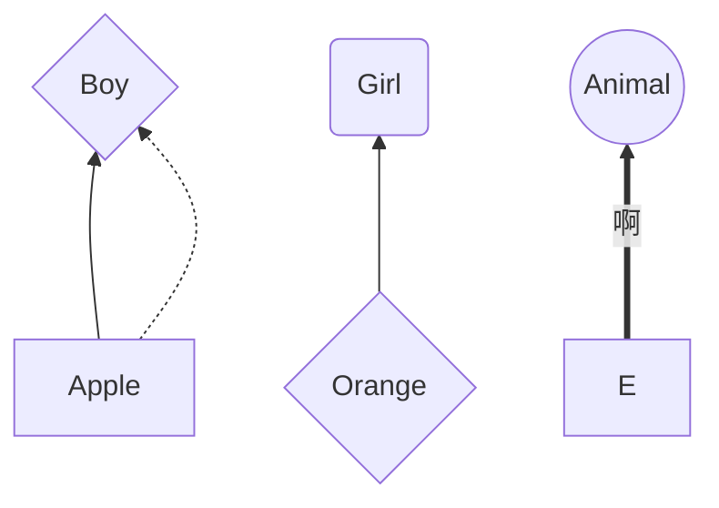
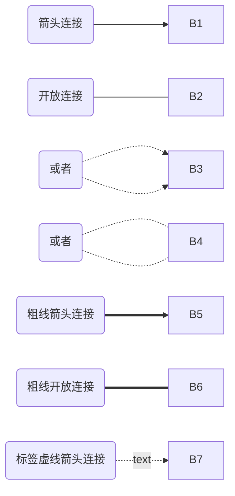

```mermaid
graph BT
A[Apple] --> B{Boy}
C{Orange} --> D(Girl)
A[Apple] .-> B{Boy}
E==啊==>F((Animal))
```

```mermaid
graph LR
 A1(箭头连接) --> B1
 
 A2(开放连接) --- B2
 
 A3(虚线箭头连接) .-> B3  
 A3(或者) -.-> B3
 
 
 A4(虚线连接) .- B4  
 A4(或者) -.- B4
 
 
 A5(粗线箭头连接)==>B5
 A6(粗线开放连接)===B6
 
 
 A7(标签虚线箭头连接) -.text.-> B7

```

